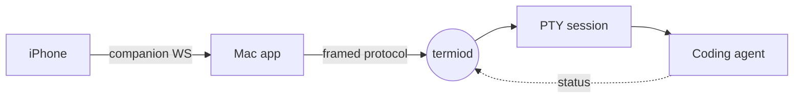
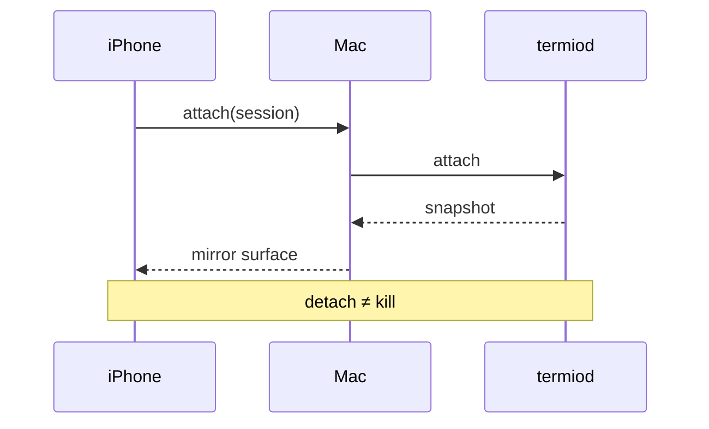
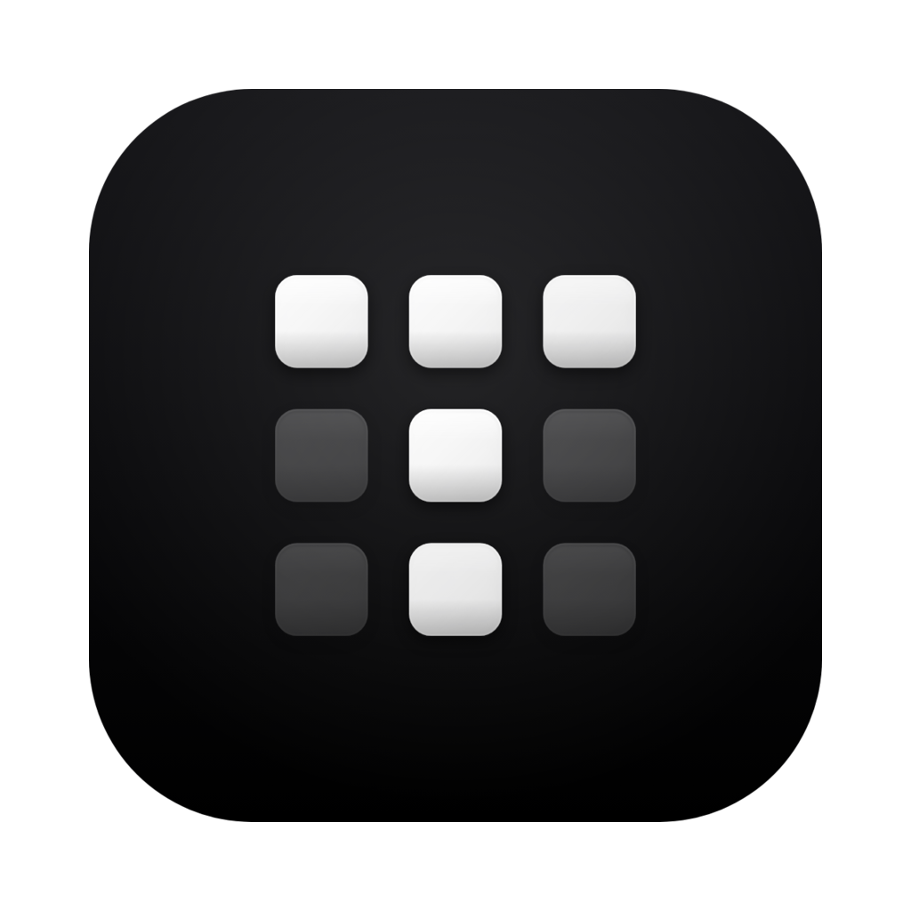

# Markdown in Termio

Everything on this page renders in Termio's Preview: open any `.md` file from the
inspector, and the reader draws it in iA Writer Quattro on a capped measure, with
code in your terminal font so Preview and Edit read as one document.

This file exists to show that surface in one screen. Flip to **Edit** at any point
to see the source behind what you are reading, then flip back.

## Headings and rhythm

### A third-level heading

#### A fourth-level heading

Hierarchy is carried by weight and space rather than rules — headings sit at 700,
inline **bold** at 600, so emphasis inside a paragraph never shouts at heading
weight. Paragraphs hard-wrapped at 80 columns in the source reflow to whatever
width the pane has.

## Inline text

Text can be **bold**, *italic*, ***both at once***, ~~struck through~~, or set as
`inline code`. Press <kbd>⌘</kbd><kbd>⇧</kbd><kbd>P</kbd> to open the command
palette. You can <mark>highlight a phrase</mark>, write H<sub>2</sub>O and
E = mc<sup>2</sup>, and abbreviate a <abbr title="pseudo-terminal">PTY</abbr>
inline.

Links come in three kinds: a [web link](https://termio.sh), a
[relative link to a file in this repo](AGENTS.md), and an
[in-page anchor](#tables) that jumps to a heading below. A bare URL such as
https://github.com/termio-sh/termio autolinks on its own. Shortcodes become
emoji: :rocket: :sparkles: :white_check_mark: :warning:

Footnotes work too — the session lives on the box, not in the connection.[^1]

## Lists

- A terminal-first agentic development environment
- Sessions that survive a closed laptop
  - `termiod` hosts the PTY on the machine itself
  - Detaching is not killing
    - Reattach restores the exact screen
- The user's machines, never a hosted control plane

1. Spawn the session
2. Attach from the Mac
3. Attach from the phone at the same time
4. Close the laptop; the agent keeps working

- [x] One protocol, versioned and transport-agnostic
- [x] Snapshots at boundaries, never per frame
- [ ] QUIC transport
- [ ] Grid diffs as an opt-in degrade

## Quotes and alerts

> Elegance is a small surface area. No grand architecture, no cut-rate MVP.
>
> > A nested quote, for a reply inside a reply.

> [!NOTE]
> Byte delivery never blocks on a host-side VT parse. The authoritative VT is a
> sidecar for snapshots.

> [!TIP]
> `TERMIO_CHANNEL=dev` gets you a fully separate app — its own bundle id, state
> directory, companion port and CLI — so a dev build can never disturb the release
> one.

> [!IMPORTANT]
> The user's `~/.ssh/config` is authoritative. Read it, never override it.

> [!WARNING]
> A blocking PTY write under the surface lock beachballs the whole app.

> [!CAUTION]
> Never add an SPM dependency that ships resources: the generated `Bundle.module`
> accessor resolves against a build-machine path and crashes in a shipped `.app`.

## Code

Fenced code is highlighted by the same highlight.js the editor uses, so a block
here matches the source you flipped from.

```swift
/// One PTY per session; panes and layout are client concerns.
func attach(to session: SessionID) async throws -> Snapshot {
    let stream = try await transport.open(.attach(session))
    for try await frame in stream {
        guard case .snapshot(let grid) = frame else { continue }
        return grid
    }
    throw AttachError.streamEndedBeforeSnapshot
}
```

```rust
// termiod: the durable session host. One code path for laptop, VPS and devbox.
pub async fn spawn(cmd: Command, size: WinSize) -> Result<Session> {
    let pty = Pty::open(size)?;
    let child = pty.spawn(cmd)?;
    Ok(Session::new(child, pty))
}
```

```bash
swift build                                # resolve + compile
swift test                                 # run the unit tests
TERMIO_CHANNEL=dev ./scripts/build-app.sh  # side-by-side dev app
```

```json
{
  "session": "termio://session/9E2C1F04-6B7A-4E5D-9C31-5A0D7B18E2F1",
  "status": "needs-you",
  "device": "devbox",
  "attached": ["mac", "iphone"]
}
```

```diff
- let maximized = NSHostingView(rootView: AnyView(InspectorDetailContent()))
+ let maximized = NSHostingView(rootView: AnyView(MaximizedDetailContent()))
```

An unlabelled fence stays plain:

```
$ termio agent report --status done
ok
```

## Diagrams

A ```` ```mermaid ```` fence is drawn as a real diagram, not a code block.





## Tables

| Channel | Bundle id | State directory | Companion port |
| --- | --- | --- | --- |
| release | `sh.termio.app` | `~/.termio` | 8787 |
| dev | `sh.termio.app.dev` | `~/.termio-dev` | 8788 |

Alignment is honored per column:

| Left | Center | Right |
| :--- | :----: | ----: |
| snapshot | attach | 1 |
| grid diff | resize | 24 |
| raw bytes | always | 1440 |

## Math

Inline math sits in a sentence: the anti-100× invariant says parse cost stays off
the delivery path, so throughput is $O(n)$ in bytes written, never $O(n \cdot m)$
in cells parsed.

$$
\text{latency} = t_{\text{pty}} + t_{\text{pipe}} + t_{\text{draw}}
$$

## Images

Relative image paths resolve against the file's own folder:



## Collapsed detail

<details>
<summary>Why the terminal is the interface</summary>

Coding agents live in terminals. A chat lens over the same session has been built
and fully reverted twice — the transcript is already the record, and rendering it
as a second, lossier surface only adds a place for the two to disagree.

</details>

## Definitions

<dl>
  <dt>Attach</dt>
  <dd>Bind a viewer to a running session and receive a snapshot.</dd>
  <dt>Detach</dt>
  <dd>Drop the viewer. The session keeps running on the host.</dd>
  <dt>Observer</dt>
  <dd>A reader that never claims the write token.</dd>
</dl>

## 中文排版

同一份阅读器也照顾中文：整篇文档是中文时行距会放宽，标点会做压缩处理，所以「引号」、
（括号）和逗号之间不会留出突兀的空白。中英混排时——比如提到 `termiod` 或 PTY——西文
仍然保持原本的字距。

---

That is the whole surface: frontmatter, headings, inline styles, links, footnotes,
lists, alerts, code, diagrams, tables, math, images, collapsible sections and
tables of terms. Press <kbd>Esc</kbd> to close the reader and land back in the
terminal.

[^1]: An agent keeps working while the laptop is shut; reattaching restores the
    exact screen it left behind.
