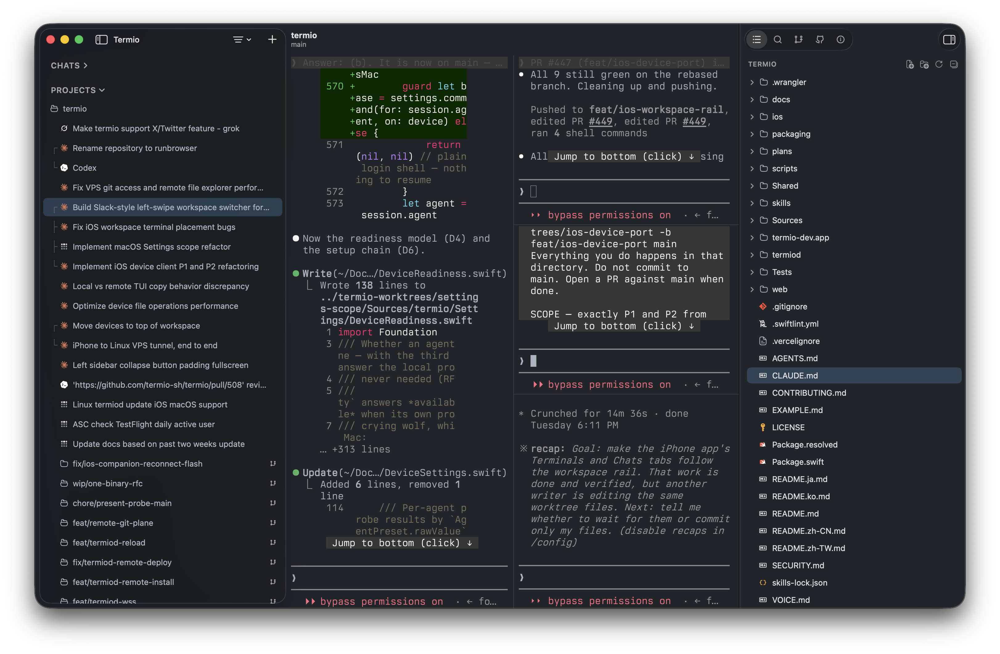
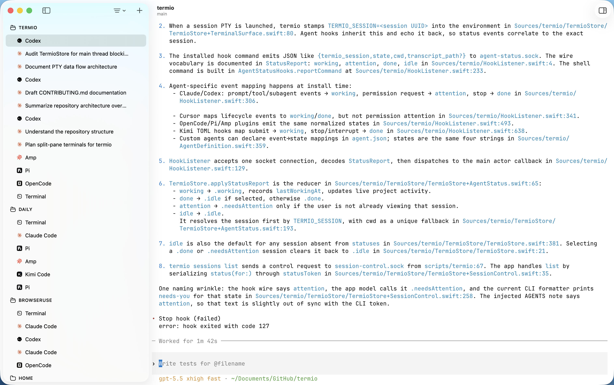
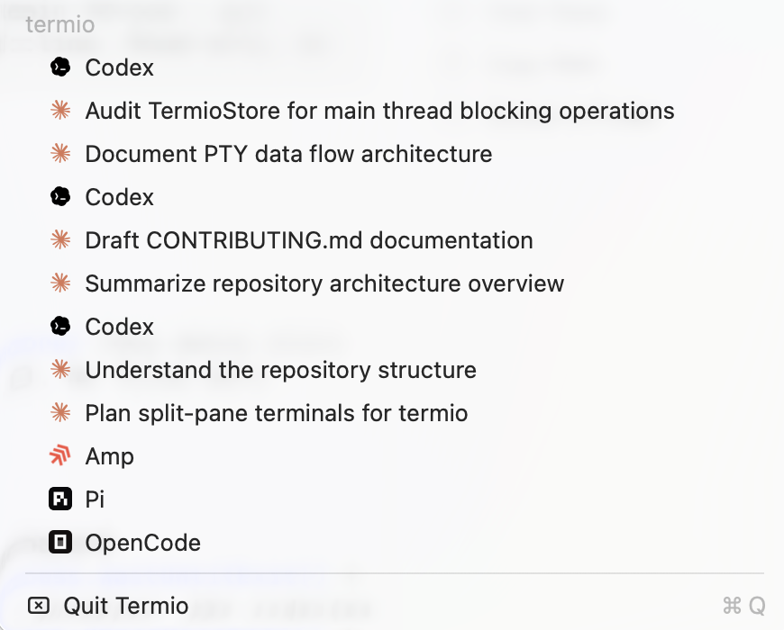
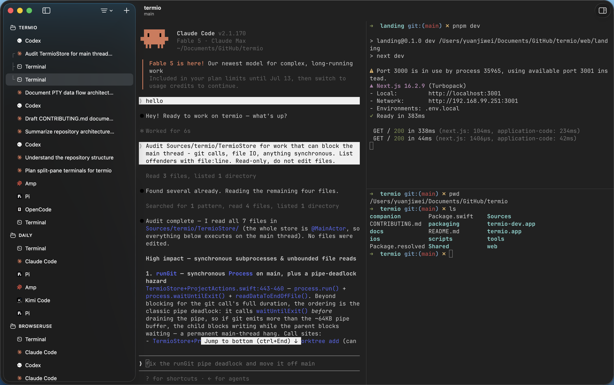
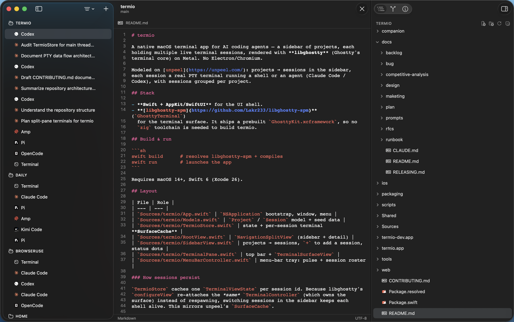
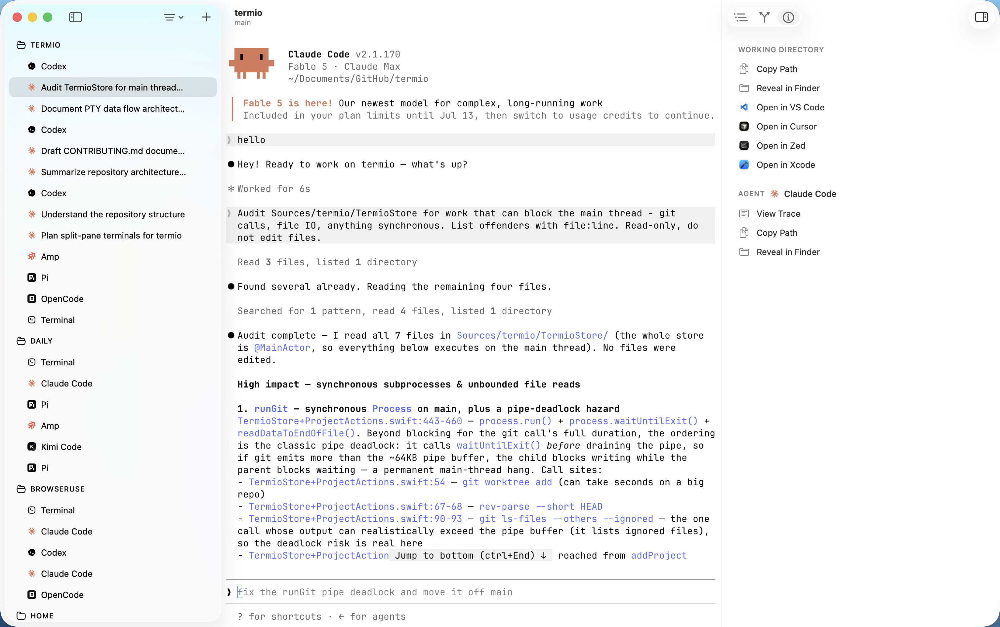
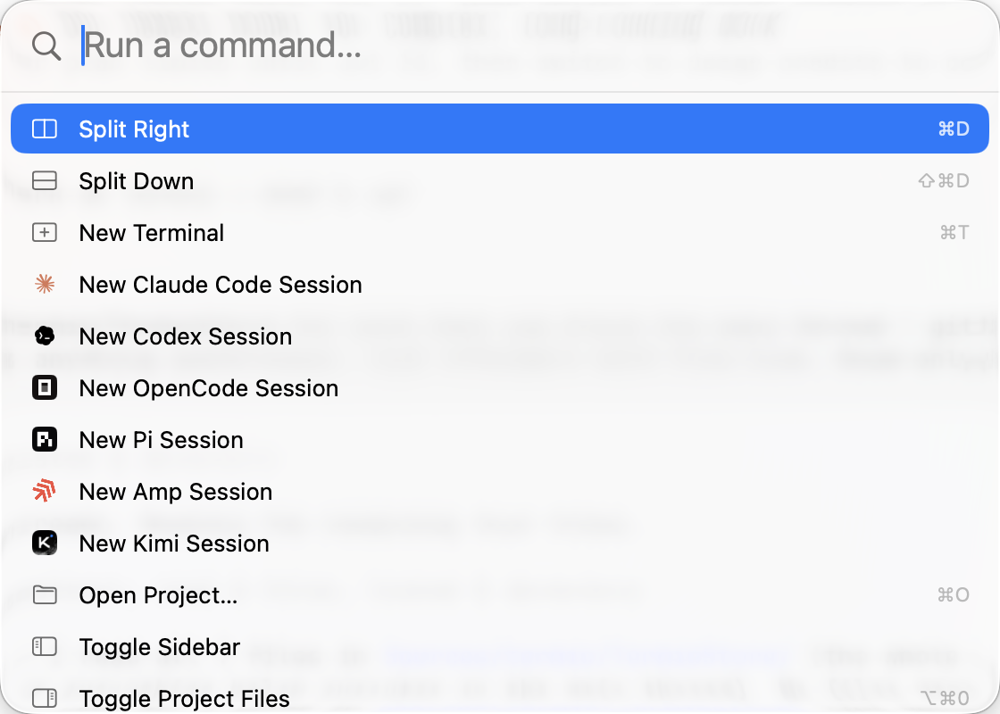
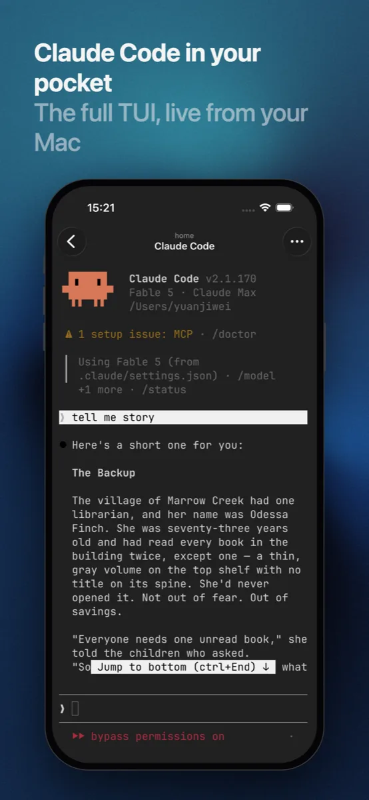
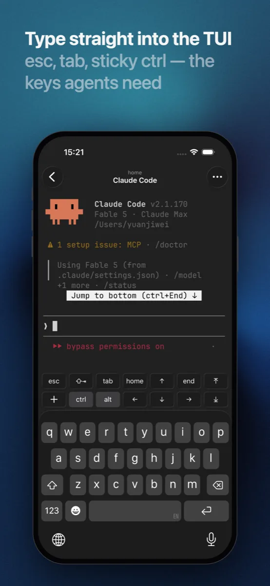
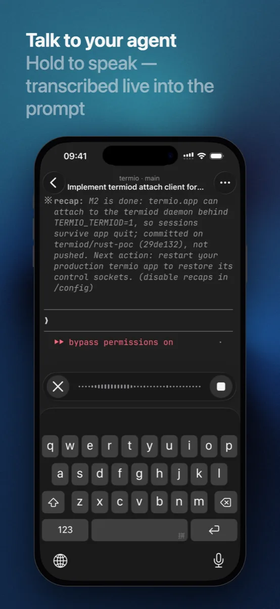

<div align="center">


### 终端优先的智能体开发环境

[](https://github.com/termio-sh/termio/releases)
[](LICENSE)
[](https://discord.gg/H9DKVwsE5f)

<p><a href="README.md">English</a> | 简体中文 | <a href="README.zh-TW.md">繁體中文</a> | <a href="README.ja.md">日本語</a> | <a href="README.ko.md">한국어</a></p>

<br />

在一个原生 Mac 应用里并排运行 Claude Code、Codex 和任意 CLI 代理 —<br />
每个会话都实时显示在侧边栏，菜单栏的小圆点告诉你谁在等你。

<br />

[**下载 macOS 版**](https://downloads.termio.sh/termio.dmg) &nbsp;&bull;&nbsp; [官网](https://termio.sh) &nbsp;&bull;&nbsp; [文档](https://termio.sh/docs) &nbsp;&bull;&nbsp; [更新日志](https://termio.sh/changelog) &nbsp;&bull;&nbsp; [Discord](https://discord.gg/H9DKVwsE5f)

<br />



</div>

## 为“看着代理干活”而生

IDE 是围绕一个人敲代码设计的。当大部分代码由 AI 编码代理来写时，环境的职责就变了：它是代理工作的地方，也是你指挥、审阅、帮它们解困的地方。termio 就是这样的环境 — 终端优先，因为代理本来就活在终端里 — 为工作的新形态而造：几个代理同时推进，大多数不用你管，只有一个卡住了。（更完整的论述见
[*From IDE to ADE*](docs/essays/from-ide-to-ade.md)。）

- **真正的终端，不是 Web 视图。** Swift + AppKit，基于
  [libghostty](https://ghostty.org)（Ghostty 的终端核心），用 Metal 渲染。
  没有 Electron，没有 xterm.js。
- **项目 → 会话。** 侧边栏映射你真实的工作方式：每个项目容纳它的终端和代理，
  git 工作树嵌套在项目下，用来并行处理多个任务。
- **状态零配置。** termio 自动接好每个代理自己的 hook，读取代理本就发出的信号。
  工作中、空闲，还是*等你处理* — 每个会话都有状态圆点，菜单栏托盘平时安静，
  代理干活时脉动，有代理被你卡住时响铃提醒。
- **不离开就能审阅。** 只读的 git 面板（变更、历史、统一 diff）、
  带点击即编辑器的文件树、项目级内容搜索 — 提交代码依然在终端里完成。
- **免费。** 无需账号，没有许可证密钥，没有付费档位。MIT 许可。

## 功能

<table>
<tr>
<td width="50%" valign="middle">

### 会话并排

每个项目保有自己的终端和代理会话。从侧边栏即刻切换 — 每个会话都是一个
持续运行的真实 PTY，你看别处时它也不会停。

</td>
<td width="50%">
  
</td>
</tr>
<tr>
<td width="50%" valign="middle">

### 知道代理什么时候需要你

会话圆点显示工作中 / 空闲 / 等你处理，并汇总到菜单栏托盘，在任何应用里
瞥一眼就知道。从托盘选中一个会话，termio 会把它带到最前面。

</td>
<td width="50%">
  
</td>
</tr>
<tr>
<td width="50%" valign="middle">

### 分屏

会话内的 Ghostty 风格分屏：左边跑代理，右边是开发服务器和一个 shell。

</td>
<td width="50%">
  
</td>
</tr>
<tr>
<td width="50%" valign="middle">

### 文件与内置编辑器

终端旁的文件树；点开一个文件就地编辑，带语法高亮和自动保存。图片和 PDF
在 Quick Look 中打开。⌘-点击代理输出的任意路径即可预览。

</td>
<td width="50%">
  
</td>
</tr>
<tr>
<td width="50%" valign="middle">

### 检查器

当前会话的一切尽在其中：带统一 diff 的 git 变更与历史、项目级内容搜索、
可读的代理对话记录，以及工作目录操作。

</td>
<td width="50%">
  
</td>
</tr>
<tr>
<td width="50%" valign="middle">

### 命令面板

一个搜索框，跳到任意会话、项目或操作。

</td>
<td width="50%">
  
</td>
</tr>
</table>

**还有这些：**

- **Git 工作树**：从侧边栏创建工作树，它会以嵌套文件夹的形式出现在项目下 —
  一个分支对应一个并行任务。你在 CLI 里创建的工作树也会显示出来。
- **Chats**：不属于任何项目的临时代理对话，一个快捷键就能打开。
- **用量仪表**：你的 Claude 和 Codex 套餐额度，从它们各自的凭据本地读取，
  在 Settings → Usage 中查看。
- **主题**：浅色、深色，以及跟随系统的玻璃外观。
- **自动更新**：经过公证的 DMG，用 Sparkle 更新；新版本自动安装。

## 与你的代理协作

Claude Code、Codex、Gemini CLI、Grok、Cursor Agent、Copilot、Amp、OpenCode、
Pi、Kimi — 以及任何其他 CLI 代理，因为会话就是一个真实的终端。
对于内置支持的代理，termio 会自动安装每个代理自己的 hook 或插件，
状态检测在你第一次启动它们时就能工作。

## 从终端驱动

termio 附带一个 `termio` CLI，会话因此可以脚本化 — 包括被代理自己调用。
运行在 termio 里的代理可以派生一个同伴会话，交给它一个任务，再读回结果：

```sh
termio sessions list                       # 谁在工作、空闲，或在等你
termio sessions spawn "fix the flaky test" # 用一条提示启动新的代理会话
termio sessions send claude@ab12cd34 "1"   # 回答同伴会话的权限询问
termio sessions watch                      # 实时流式输出状态变化
```

## 在你的 iPhone 上

配套应用把每个 Mac 会话实时镜像到手机上 — 是完整的 TUI，不是聊天摘要。
按键栏把 esc、tab、ctrl 和方向键放在键盘上方，按住说话可以直接把语音转写进
提示词。免费，公测中：[加入 TestFlight](https://testflight.apple.com/join/1Arf1UKR)。

<table>
<tr>
<td width="33%">
  
</td>
<td width="33%">
  
</td>
<td width="33%">
  
</td>
</tr>
</table>

## 安装

**[下载 macOS 版 termio](https://downloads.termio.sh/termio.dmg)** — 免费，
无需账号。需要 macOS 14+。

或者用 [Homebrew](https://brew.sh) 安装：

```sh
brew install --cask termio-sh/tap/termio
```

**iPhone 上**：在
[TestFlight](https://testflight.apple.com/join/1Arf1UKR) 获取配套应用公测版，
然后扫描 Mac 应用 Settings ▸ Mobile 里的二维码完成配对。

## 社区

- **[Discord](https://discord.gg/H9DKVwsE5f)** — 与开发者和其他用户交流
- **[GitHub Issues](https://github.com/termio-sh/termio/issues)** — 报告 bug 和提功能需求

## 贡献者

<a href="https://github.com/termio-sh/termio/graphs/contributors">
  
</a>

## 许可证

[MIT](LICENSE)。
