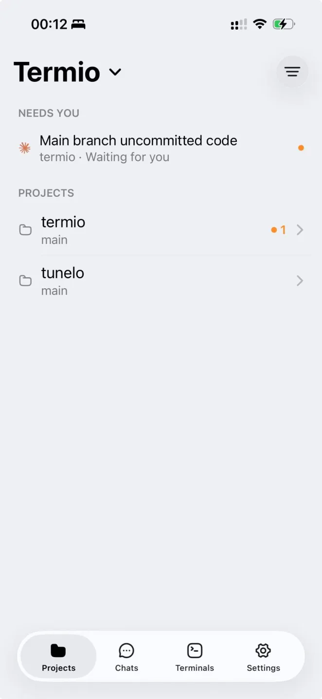
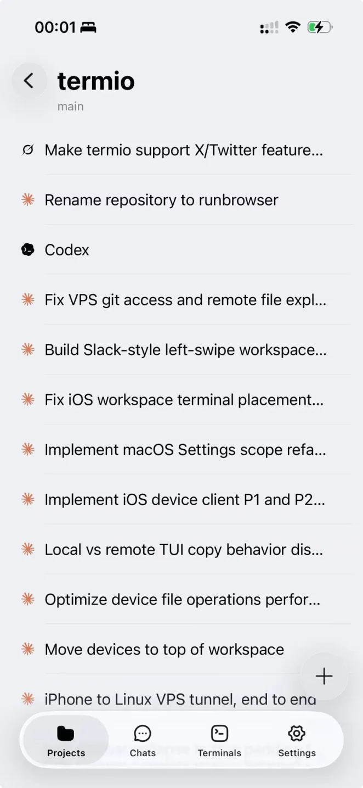
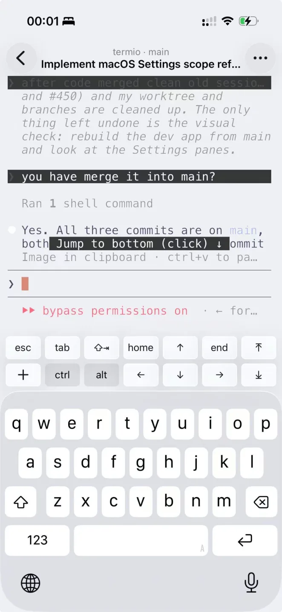
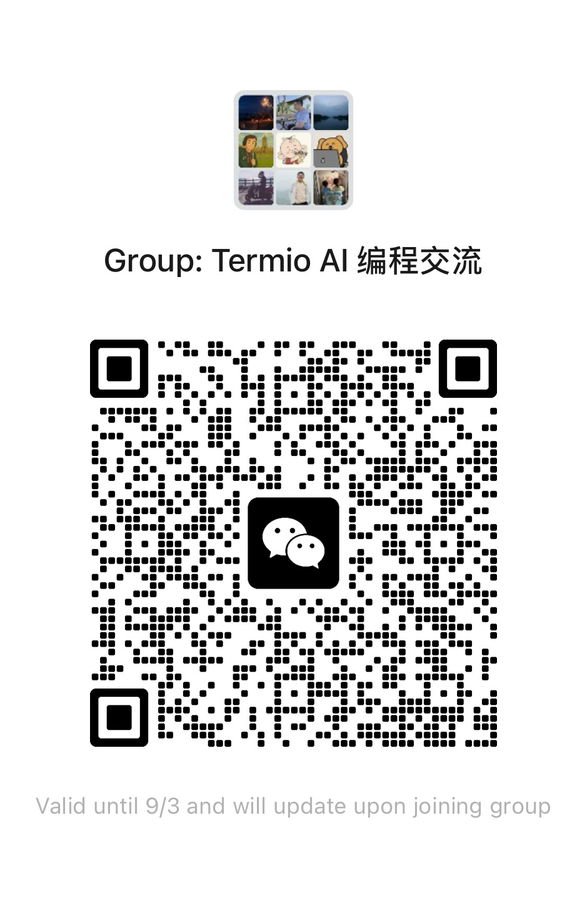

> 如对翻译有改进建议，欢迎提交 PR。

<div align="center">


### 终端优先的 Agent 开发环境

[](https://github.com/termio-sh/termio/releases)
[](LICENSE)
[](https://discord.gg/H9DKVwsE5f)

<p><a href="README.md">English</a> | 简体中文 | <a href="README.zh-TW.md">繁體中文</a> | <a href="README.ja.md">日本語</a> | <a href="README.ko.md">한국어</a></p>

<br />

在真实的 Mac 终端里并排跑 Claude Code、Codex 和任意 CLI Agent——<br />
Swift 加 libghostty，没有 Electron。菜单栏的圆点告诉你哪个在等你，<br />
人不在桌前的时候，iPhone 来告诉你。

<br />

[**下载 macOS 版**](https://downloads.termio.sh/termio.dmg) &nbsp;&bull;&nbsp; [官网](https://termio.sh) &nbsp;&bull;&nbsp; [文档](https://termio.sh/docs) &nbsp;&bull;&nbsp; [更新日志](https://termio.sh/changelog) &nbsp;&bull;&nbsp; [Discord](https://discord.gg/H9DKVwsE5f)

<br />


</div>

## 安装

**[下载 macOS 版 Termio](https://downloads.termio.sh/termio.dmg)**——免费，
不用账号，需要 macOS 14 或更高版本。也可以走 [Homebrew](https://brew.sh)：

```sh
brew install --cask termio-sh/tap/termio
```

**iPhone 端**：从
[TestFlight](https://testflight.apple.com/join/1Arf1UKR) 装伴侣应用的公测版，
再扫 Mac 应用 **设置 ▸ 手机** 里的二维码配对。

## 为 Agent 编程而造

IDE 是围绕一个人敲代码设计的。代码大半改由 Agent 写之后，开发环境的职责跟着变：
它既是 Agent 干活的地方，也是你指挥、审阅、给它们解困的地方。Termio 就是这样一个
环境——终端优先，因为 Agent 本来就住在终端里——它对着工作的新形状造：几个 Agent
同时在跑，大多数不用你管，有一个卡住了。（更完整的论述见
[*From IDE to ADE*](docs/essays/from-ide-to-ade.md)。）

- **真实的终端，不是网页视图。** Swift + AppKit，跑在
  [libghostty](https://ghostty.org)（Ghostty 的终端内核）上，用 Metal 渲染。
  没有 Electron，也没有 xterm.js。
- **项目 → 会话。** 侧栏映射你实际的工作方式：每个项目装着自己的终端和 Agent，
  git worktree 嵌在项目下面，一条分支对应一项并行任务。
- **状态不用配。** Termio 自动接好每个 Agent 自带的 hook，读它们本来就会发出的
  信号。工作中、空闲，还是*需要你*——每个会话一个状态点；菜单栏托盘平时安静，
  Agent 干活时脉动，有 Agent 被你挡住时出声。
- **审阅不必离开。** 只读的 git 面板（更改、历史、统一 diff）、点击即编辑的文件树、
  项目级内容搜索——提交仍然在终端里做。
- **Git worktree。** 从侧栏创建，以嵌套文件夹出现在项目下，一条分支对应一项并行任务。
- **聊天。** 不属于任何项目的一次性 Agent 会话。
- **用量仪表。** Claude 和 Codex 的套餐额度，在 **设置 ▸ 用量** 里本地读取。
- **主题。** 浅色、深色，以及跟随系统的玻璃外观。
- **自动更新。** 经过公证的 DMG，由 Sparkle 更新。
- **免费。** 不用账号，没有许可证密钥，也没有付费档位。MIT 许可。

## 不需要学 tmux 了

所有人劝你学 tmux 的理由，是跑 Agent 需要比终端活得久的会话——退出 app、合上
笔记本，Agent 得继续干活。这件事 Termio 开箱就做了：每个会话的 shell 都活在
守护进程 `termiod` 里，退出 app 只是断开连接。再打开，Agent 还在你离开的地方——
同一个进程，同一份回滚历史。只有"关闭会话"（⌘W）会结束它。

tmux 剩下要教你的东西，要么是一个 Mac 快捷键，要么你本来就会：

- 分屏：⌘D，放大：⇧⌘↩——不用先按 Ctrl-b。⌘ 快捷键根本不会传进窗格里的程序，
  所以永远不会和 vim 或 TUI 抢键。
- 翻历史、选文本、复制：触控板、鼠标、⌘C。没有 copy-mode 要进出。
- Linux 机器上的会话：同一个守护进程跑在那边，任何 shell 里
  `termiod attach <session>` 就能接上。
- 脚本化：`termio sessions`（见下文）干的就是 `send-keys` 脚本干的事，而且
  Agent 状态是协议对象，不用抓屏。

没有前缀键，没有 `.tmux.conf`，不用装插件来恢复会话——持久化生效之前，没有任何
东西需要配置。如果 tmux 已经是你的肌肉记忆，它在会话里照样能跑，和别的程序一样。

## 和你现有的 Agent 一起用

Claude Code、Codex、Antigravity、Grok、Cursor Agent、Copilot、Amp、OpenCode、
Pi、Kimi——以及任何其他 CLI Agent，因为会话本来就是一个真实终端。
内置的那些，Termio 会自动装上它们各自的 hook 或插件，你第一次启动它们时状态检测
就已经在了。

## 从终端驱动

Termio 附带 `termio` 命令行工具，会话因此可以脚本化——Agent 自己也能调。跑在 Termio
里的 Agent 可以派生一个同伴，交给它一个任务，再把回复读回来：

```sh
termio .                                    # 把当前目录作为项目打开
termio sessions list                        # 谁在工作、空闲，或在等你
termio sessions spawn "fix the flaky test"  # 用一段提示启动新的 Agent 会话
termio sessions run "pnpm test --watch"     # 用一条命令启动普通终端会话
termio sessions send ab12cd34 "1"           # 回答同伴的权限确认
termio sessions read ab12cd34 --lines 40    # 打印某个会话当前的屏幕
termio sessions watch                       # 实时流式输出状态变化
termio sessions focus ab12cd34              # 在应用里把某个会话切到前台
termio sessions close ab12cd34              # 关掉它
termio notify "the migration finished"      # 发一条 macOS 通知
```

剩下的交给参数：`--wait` 一直等到这一轮结束，回来时带上最终状态和可以去读的记录行
范围；`--json` 让任何 `sessions` 命令输出机器可读的结果；`--agent` 决定 `spawn`
启动哪个 Agent；`--direction` / `--ratio` 决定新面板落在哪、占多大。

```sh
termio sessions spawn "run the migration" --agent codex --wait
```

Agent 自己会学会这套：会话控制会往每个 Agent 的技能目录（`~/.claude/skills`、
`~/.codex/skills`）装一个 `termio`
[Agent 技能](https://termio.sh/skill.md)，并在每次启动时保持它最新。
其他 Agent 也可以直接从这个仓库装同一个技能：

```sh
npx skills add termio-sh/termio --skill termio
```

## 在你的 iPhone 上

伴侣应用把每个 Mac 会话实时镜像到手机上——是完整的 TUI，不是聊天摘要。按键条把
esc、tab、ctrl 和方向键放在键盘上方，按住说话把语音直接转写进提示词。免费，公测中：
[加入 TestFlight](https://testflight.apple.com/join/1Arf1UKR)。

<table>
  <tr>
    <td></td>
    <td></td>
    <td></td>
  </tr>
</table>

## 架构

Termio 的每个会话都跑在 `termiod` 上——一个小小的 Rust daemon，在活儿实际跑的那台
机器上持有 PTY。每个界面——Mac 应用、手机、浏览器——都是通过同一套带版本的协议附着
上去的客户端。

```
  web     ─WSS──┐
  iPhone  ─WSS──┼─► termiod (Mac)    ─► PTY ─► shell / agent
  Mac app ─unix─┘

  web     ─WSS──┐
  iPhone  ─WSS──┼─► termiod (Linux)  ─► PTY ─► shell / agent
  Mac app ─ssh──┘
```

变的只有管道，每一段上的帧完全一样。没有哪个客户端要穿过另一个客户端才能拿到会话
——手机因此不是 Mac 的卫星，VPS 上的会话和笔记本上的会话也因此是同一种东西。

**已经有的：** daemon 和它的协议、`unix`、`ssh`、`wss` 三种传输、附着时的快照、
回滚、文件和 git 平面，以及 launchd/systemd 托管。Mac 应用的每个会话都跑在它上面，
手机通过 WSS 附着到 Mac 或 Linux 机器。**还没有的：** 浏览器客户端。

推导过程写在 [`termiod/ARCHITECTURE.md`](termiod/ARCHITECTURE.md) 和
[`docs/`](docs/README.md) 下的设计笔记里。

## 路线图

- **Linux 远程服务器** — 会话跑在你自己的 Linux 机器上（VPS、开发机），在 Mac
  应用里统一带。
- **Mux 服务器** — 持久的会话宿主：会话活在机器上，不在连接里。合上笔记本，Agent
  继续干活；重新附着，屏幕原样回来。
- **Issue 分诊** — GitHub、GitLab、Linear 的 issue 直接进应用，随手交给 Agent。
- **手机上的 TUI → GUI** — 在实时镜像之上，把 Agent 会话可选地渲染成 GUI。
- **Windows 支持** — 原生 Windows 应用。同样的想法，同样的终端内核，不是 Electron
  移植。
- **Web 支持** — 从任意浏览器附着到你的会话，终端还能用链接分享。

在 [GitHub Issues](https://github.com/termio-sh/termio/issues) 关注进展或参与讨论。

## 社区

**Termio 正在找长期维护者。** 如果你喜欢用它，也想认领路线图里的某一块——Linux
远程服务器、Web 客户端、Windows，或者 iOS 伴侣应用——来 Discord 打个招呼，或者
直接捡一个 issue。

- **[Discord](https://discord.gg/H9DKVwsE5f)** — 和开发者以及其他用户交流
- **微信群** — 中文用户扫下面的二维码
- **[GitHub Issues](https://github.com/termio-sh/termio/issues)** — bug 和功能需求



微信二维码每几天失效一次。失效了就在 Discord 说一声，会换上新的。

## 贡献者

<a href="https://github.com/termio-sh/termio/graphs/contributors">
  
</a>

## 许可证

[MIT](LICENSE)。
