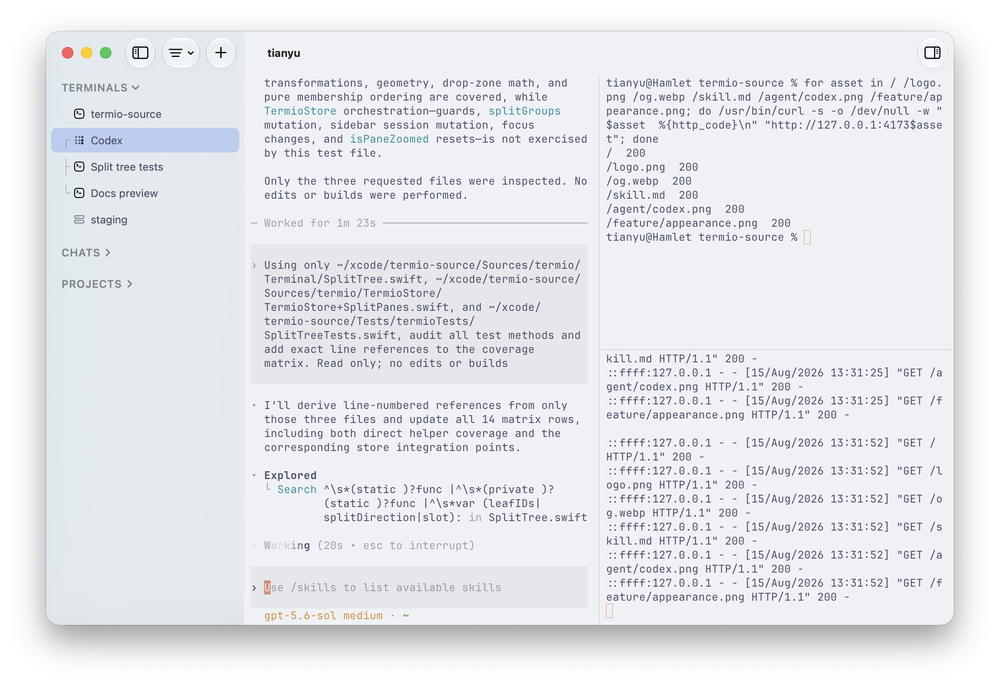
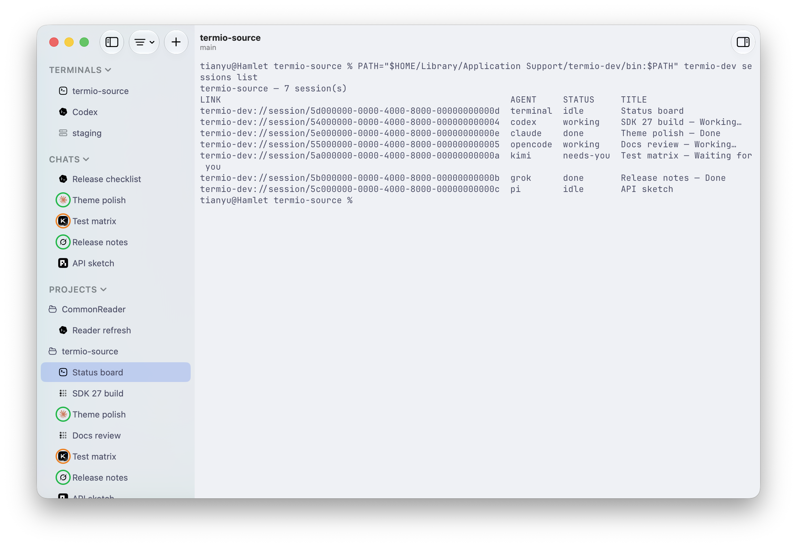
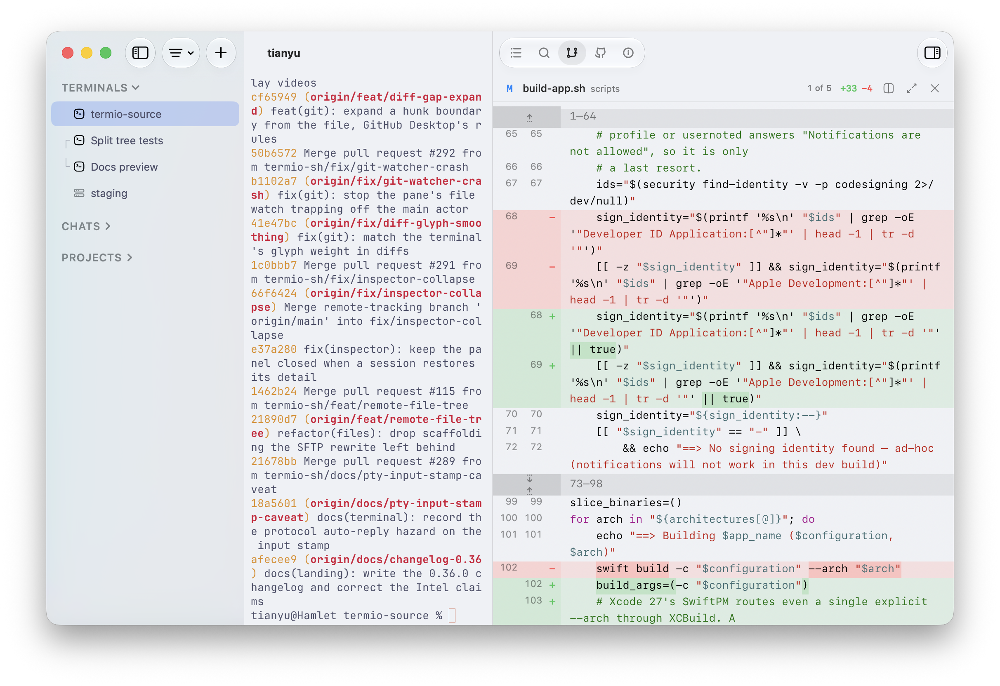
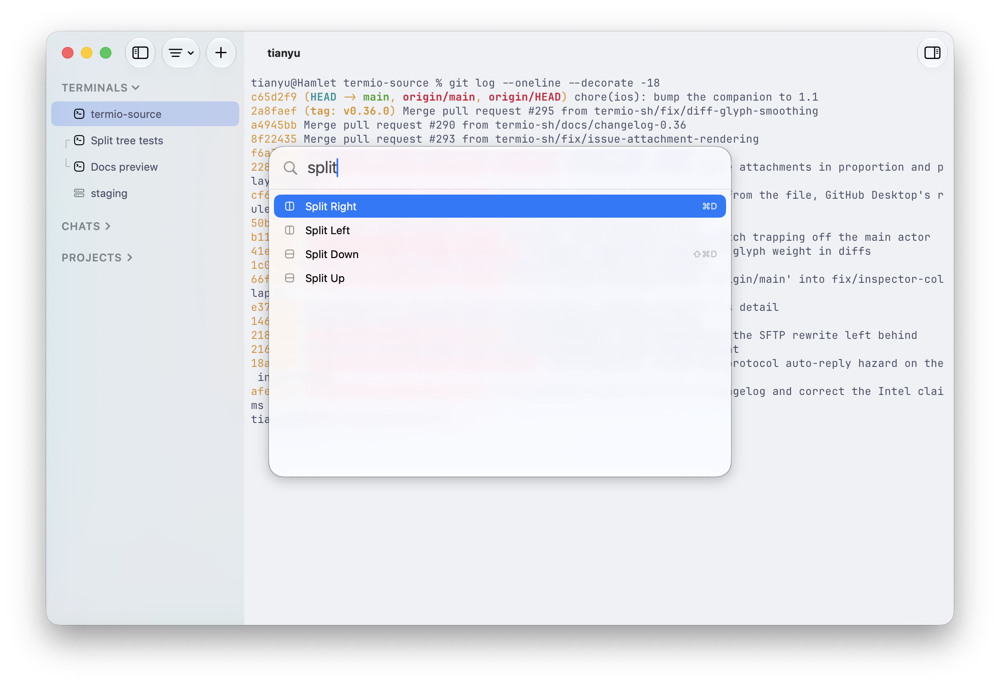

> 如對翻譯有改進建議，歡迎提交 PR。

<div align="center">


### 終端機優先的 Agent 開發環境

[](https://github.com/termio-sh/termio/releases)
[](LICENSE)
[](https://discord.gg/H9DKVwsE5f)

<p><a href="README.md">English</a> | <a href="README.zh-CN.md">简体中文</a> | 繁體中文 | <a href="README.ja.md">日本語</a> | <a href="README.ko.md">한국어</a></p>

[**下載 macOS 版**](https://downloads.termio.sh/termio.dmg) &nbsp;&bull;&nbsp; [官方網站](https://termio.sh) &nbsp;&bull;&nbsp; [文件](https://termio.sh/docs) &nbsp;&bull;&nbsp; [更新日誌](https://termio.sh/changelog) &nbsp;&bull;&nbsp; [Discord](https://discord.gg/H9DKVwsE5f)


</div>

## 終端機優先的 ADE

程式碼大半改由 Agent 寫之後，開發環境的職責就是把它們跑起來，並告訴你哪一個在等你。Termio 就是這樣一個環境，而它是一個真正的終端機——因為 Agent 本來就住在終端機裡。

它在第一次啟動時自動接好每個 Agent 自帶的 hook。工作階段會回報工作中、閒置，還是*需要你*——側邊欄一個狀態點，選單列的常駐圖示在有 Agent 被擋住時出聲，手機上是同一個訊號。Claude Code、Codex、OpenCode、Pi、Amp、Cursor、Copilot、Kimi、Antigravity、Crush、Grok，以及任何其他 CLI Agent。

更完整的論述：[*From IDE to ADE*](docs/essays/from-ide-to-ade.md)。

### tmux 的替代品

所有人勸你學 tmux 的理由，Termio 讓你不用學。每個工作階段的 shell 都活在常駐程式 `termiod` 裡，結束 app 只是中斷連線。闔上筆電，再打開 Termio，Agent 還在你離開的地方——同一個行程，同一份捲動紀錄。只有「關閉工作階段」（⌘W）會結束它。

分割是 ⌘D，放大是 ⇧⌘↩。不用 Ctrl-b 前綴鍵：⌘ 快速鍵根本不會傳進窗格裡的程式，所以永遠不會和 vim 或 TUI 搶按鍵。捲動、選取、複製，用觸控板和 ⌘C。沒有 copy-mode。

### 遠端 VPS

任何你能 `ssh` 上去的 Linux VPS。Termio 讀 `~/.ssh/config`，從不改寫它。**設定 ▸ 裝置 ▸ 設定**會透過 SSH 把一個執行檔複製到 `~/.local/bin`，啟動常駐程式，並在那台機器上裝好 Agent 的 hook。本機和遠端的工作階段走的是同一套主機。

工作階段活在機器上，不在連線裡。斷線之後 Agent 繼續工作；重新接上，畫面原樣回來。Zed Remote 和 VS Code Remote 則把遠端工作困在一條活著的連線裡。

## 橫向比較

| | 它是什麼 | Termio 有什麼不同 |
| --- | --- | --- |
| **[Ghostty](https://ghostty.org)** | 終端機本身。Termio 用它的核心 [libghostty](https://ghostty.org) 算繪，不是 fork。 | Ghostty 不追蹤 Agent，不保存工作階段，也不在 VPS 上跑它們。你要的是一個快的終端機，那就用 Ghostty。Termio 是 Agent 跑在裡面的環境。 |
| **[cmux](https://cmux.com)** | 最接近的同類：原生 Swift、libghostty、Agent 需要你時響鈴、iPhone 配套應用程式。它的遠端是一個 SSH 工作區——機器上跑一個中繼，想要的話再加 tmux——手機與 Mac 配對。 | 每個工作階段都跑在 `termiod` 上，這台 Mac 或一台 Linux VPS，手機直接接上那台主機。狀態放在選單列，專案和 worktree 放在側邊欄。cmux 有內建的可指令稿化瀏覽器，也會讀你的 Ghostty 設定；Termio 沒有。 |
| **[herdr](https://herdr.dev)** | 跑在你現有終端機裡的多工器。同樣的持久化想法——一個伺服器持有 PTY——而且會標記每個 Agent 工作中、被擋住還是閒置。形狀是 tmux 式的：前綴鍵、TUI、透過 SSH 接上，支援 macOS / Linux / Windows。 | 一個原生 Mac 應用程式，有 Mac 快速鍵、iPhone 配套應用程式，VPS 是側邊欄裡的一個工作區——不是一個你去接上的 TUI。 |
| **[Otty](https://otty.sh)** | 為 Agent 調校過的原生 Mac 終端機：分頁標記、輸入框、能恢復 Claude / Codex / OpenCode 的工作階段還原。它介於終端機和 ADE 之間。 | Termio 是這件事的 ADE 那一側：工作階段活在 `termiod` 裡，結束 app 也不會消失，在 Linux VPS 上和在你 iPhone 上都是同一個物件。 |

## 安裝

**[下載 macOS 版 Termio](https://downloads.termio.sh/termio.dmg)** — 免費、
不需帳號，需要 macOS 14 或以上版本。或透過 [Homebrew](https://brew.sh) 安裝：

```sh
brew install --cask termio-sh/tap/termio
```

**iPhone 端**：先到
[TestFlight](https://testflight.apple.com/join/1Arf1UKR) 取得配套應用程式
測試版，再掃 Mac 應用程式「設定 ▸ 手機」裡的 QR code 完成配對。

## 你會得到什麼

<table>
<tr>
<td width="50%" valign="top">
<h3>專案裝著工作階段</h3>
<p>一個 checkout 一個專案，它的終端機和 Agent 都在下面。聊天排在專案上方——不屬於任何專案的一次性 Agent 工作階段。</p>

</td>
<td width="50%" valign="top">
<h3>Git worktree</h3>
<p>一條分支對應一項並行任務，從側邊欄建立。Worktree 巢狀在它來自的專案下面。</p>

</td>
</tr>
<tr>
<td width="50%" valign="top">
<h3>分割窗格</h3>
<p>⌘D 向右分割，⇧⌘D 向下分割。一個 Agent、一個開發伺服器、一個 shell，同一個視窗。</p>

</td>
<td width="50%" valign="top">
<h3>狀態一眼看清</h3>
<p>工作中、閒置、完成，還是<em>需要你</em>——每一列都有標記。同一份清單就是 <code>termio sessions list</code>。</p>

</td>
</tr>
<tr>
<td width="50%" valign="top">
<h3>檔案編輯器</h3>
<p>在檔案樹裡點一個檔案。語法高亮、自動儲存。提交仍然在終端機裡做。</p>

</td>
<td width="50%" valign="top">
<h3>變更</h3>
<p>唯讀的 git 面板，顯示目前的統一 diff。提交、推送和開 PR 仍然在終端機裡。</p>

</td>
</tr>
<tr>
<td width="50%" valign="top">
<h3>搜尋</h3>
<p>專案層級的內容搜尋，點一下就跳到編輯器裡符合的那一行。</p>

</td>
<td width="50%" valign="top">
<h3>命令面板</h3>
<p>⌘⇧P。分割、聚焦，一切你本來要翻選單找的東西。</p>

</td>
</tr>
</table>

## 從終端機驅動

`termio` 命令列工具驅動正在執行的應用程式。跑在 Termio 裡的 Agent 可以衍生一個同伴，交給它一個任務，再把回覆讀回來：

```sh
termio .                                    # 把目前目錄當作專案開啟
termio sessions list                        # 誰在工作、閒置，或在等你
termio sessions spawn "fix the flaky test"  # 用一段提示啟動新的 Agent 工作階段
termio sessions run "pnpm test --watch"     # 用一條命令啟動一般終端機工作階段
termio sessions send ab12cd34 "1"           # 回答同伴的權限確認
termio sessions read ab12cd34 --lines 40    # 印出某個工作階段目前的畫面
termio sessions watch                       # 即時串流狀態變化
termio sessions focus ab12cd34              # 在應用程式裡把某個工作階段切到前景
termio sessions close ab12cd34              # 關掉它
termio notify "the migration finished"      # 送出一則 macOS 通知
```

`--wait` 一直等到這一輪結束，回來時帶上最終狀態和可以去讀的紀錄行範圍。`--json` 讓任何 `sessions` 命令輸出機器可讀的結果。`--agent` 決定 `spawn` 啟動哪個 Agent。`--direction` / `--ratio` 決定新窗格落在哪、佔多大。

```sh
termio sessions spawn "run the migration" --agent codex --wait
```

工作階段控制會往每個 Agent 的技能目錄（`~/.claude/skills`、`~/.codex/skills`）裝一個 `termio` [Agent 技能](https://termio.sh/skill.md)，並在每次啟動時保持它最新。其他 Agent 也可以直接從這個儲存庫裝同一個技能：

```sh
npx skills add termio-sh/termio --skill termio
```

## 在你的 iPhone 上

配套應用程式把每個工作階段即時鏡像過來——是完整的 TUI，不是聊天摘要。按鍵列把 esc、tab、ctrl 和方向鍵放在鍵盤上方，按住說話把語音直接轉寫進提示詞。公開測試中：[TestFlight](https://testflight.apple.com/join/1Arf1UKR)。

<table>
  <tr>
    <td></td>
    <td></td>
    <td></td>
  </tr>
</table>

## 架構

每個工作階段都活在 `termiod` 裡。用戶端只是接上去。關掉一個用戶端不會殺死 Agent。一套協定，變的只有管道。

```
  ┌─────────────────┐ unix  ┌────────────┐         ┌─────────────────┐
  │ Mac app         │──────►│            │         │                 │
  ├─────────────────┤ unix  │            │         │                 │
  │ Windows (soon)  │──────►│            │         │                 │
  ├─────────────────┤ wss   │            │         │                 │
  │ iPhone          │──────►│  termiod   │── PTY ─►│  shell / agent  │
  ├─────────────────┤ unix  │   (Mac)    │         │                 │
  │ TUI (soon)      │──────►│            │         │                 │
  ├─────────────────┤ wss   │            │         │                 │
  │ Android (soon)  │──────►│            │         │                 │
  └─────────────────┘       └────────────┘         └─────────────────┘

  ┌─────────────────┐ ssh   ┌────────────┐         ┌─────────────────┐
  │ Mac app         │──────►│            │         │                 │
  ├─────────────────┤ ssh   │            │         │                 │
  │ Windows (soon)  │──────►│            │         │                 │
  ├─────────────────┤ wss   │            │         │                 │
  │ iPhone          │──────►│  termiod   │── PTY ─►│  shell / agent  │
  ├─────────────────┤ ssh   │  (Linux)   │         │                 │
  │ TUI (soon)      │──────►│            │         │                 │
  ├─────────────────┤ wss   │            │         │                 │
  │ Android (soon)  │──────►│            │         │                 │
  └─────────────────┘       └────────────┘         └─────────────────┘
```

手機直接接上機器上的 `termiod`，不經過 Mac。VPS 上的工作階段和你筆電上的工作階段是同一種東西。

推導過程寫在 [`termiod/ARCHITECTURE.md`](termiod/ARCHITECTURE.md) 裡。

## 路線圖

- **Issue 分流** — GitHub、GitLab、Linear 的 issue 直接進應用程式，隨手交給 Agent。
- **TUI 用戶端** — 從任意終端機接上，像你接上 tmux 那樣。
- **手機上的 TUI → GUI** — 在即時鏡像之上，把 Agent 工作階段選擇性地算繪成 GUI。
- **Android** — 和 iPhone 一樣的配套應用程式。
- **Windows 支援** — 原生 Windows 應用程式。同樣的想法，同樣的終端機核心，不是 Electron。
- **Web 支援** — 從任意瀏覽器接上你的工作階段，終端機還能用連結分享。

在 [GitHub Issues](https://github.com/termio-sh/termio/issues) 追蹤進展或參與討論。

## 社群

**Termio 正在找長期維護者。** 如果你喜歡用它，也想認領上面路線圖裡的某一塊——Web 用戶端、Windows，或者 iOS 配套應用程式——來 Discord 打個招呼，或者直接接一個 issue。

- **[Discord](https://discord.gg/H9DKVwsE5f)** — 和開發者以及其他使用者交流
- **微信群** — 中文使用者掃下面的 QR code
- **[GitHub Issues](https://github.com/termio-sh/termio/issues)** — bug 和功能需求


微信 QR code 每幾天失效一次。失效了就在 Discord 說一聲，會換上新的。

## 貢獻者

<a href="https://github.com/termio-sh/termio/graphs/contributors">
  
</a>

## 授權

[MIT](LICENSE)。
