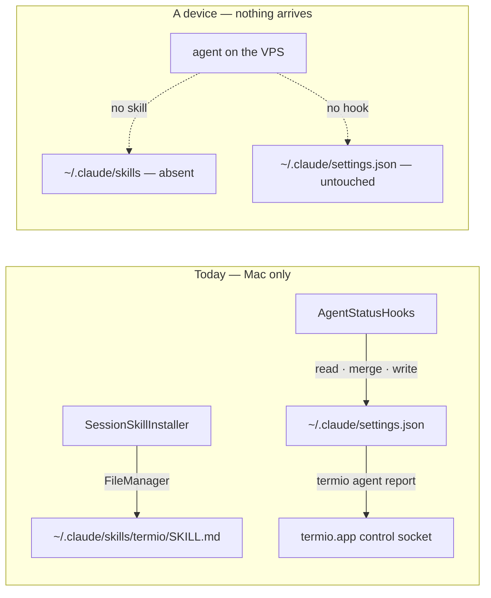

# Installing termio's agent integration on a device

> An agent on a VPS gets no skill and no hooks, because both installers write to
> this Mac's `$HOME` with `FileManager`. Give the skill a device-flavoured
> payload, give a device hook a way to name its session, and give the protocol
> the one write scope it is missing — without moving the agent catalog into Rust.

## What has already landed

Part of this is built, in the working tree, unmerged. Recorded so a reader does not
re-do it:

| Decision | State |
| --- | --- |
| D1 — device payload | **Done.** `Sources/termio/Resources/skills/termio-device/SKILL.md`, selected by `AgentIntegrationTarget.skillResourceDirectory`. Unscoped, as D1 says it must be until `Session::info()` returns the project. |
| D2 — session id in the environment | **Done.** `session::daemon_owned_env` exports `TERMIOD_SESSION_ID` and `TERMIOD_SOCK`, layered after the client's `env` so a client cannot spoof either. Two tests. |
| D2 — device hook command | **Done.** `AgentStatusHooks.reportCommand(reporter:)` emits the `set-status` form, drops the stdin-mining flags, and keeps Cursor's `printf '{}'` contract. `HookReportCommandTests`. |
| D5 — policy in the client | **Done.** `AgentConfigStore` is the seam; all four hook dialects and the skill installer go through it, and paths stay unexpanded because `~` means the *target's* home. |
| D6 — the v0 SSH arm | **Done.** `SSHAgentConfigStore`, riding `Termiod.sshArguments(host:)`. |
| D3 — `home:` dest | Not built. Belongs to the v1 transfer-plane arm; the v0 SSH arm never touches `UploadOpen`. |
| D4 — `expect_sha256` | **Done on the v0 arm**, which is where the race actually is. `AgentConfigStore.write(_:to:ifUnchangedFrom:)` commits a merge against the bytes it was computed from; `SSHAgentConfigStore` does the digest check and the rename in one remote command, so nothing slips between them. A lost race reports the agent as not installed and the pane's setup button is the retry — no re-merge loop, which would fight a live editor. The protocol-level `UploadCommit { expect_sha256 }` is still owed by the v1 arm. |
| — | **Done.** A machine's pane calls both installers with `device.integrationTarget` (`MachinePaneModel.setUp`), so §D6's surface exists and a device target now reaches them. |
| — | **Done.** The plugin dialects install on a device: the three templates take a `HookReporter` and generate the `termiod set-status` form. `DeviceHookInstallTests`. |

One behaviour worth knowing before reading further: remote status carries **state
and title only**.

Two things the device arm learned the hard way, both of which fail *silently*
because every hook form ends in `2>/dev/null || true`:

- `Termiod.remoteBinary()` is a shell **expression** (`$HOME/.local/bin/termiod`),
  not a path. Quoting it whole emits a literal `$HOME` directory. There are three
  escaping contexts for one binary — raw, shell, and JavaScript — and
  `HookReporter` now spells all three.
- `~/.config` is the **default value of `XDG_CONFIG_HOME`**, not a directory name.
  OpenCode resolves its global config under `$XDG_CONFIG_HOME/opencode` and Amp
  documents `$XDG_CONFIG_HOME/amp/plugins`, so a Linux box whose owner moved their
  config would take a plugin into a directory the agent never reads.
  `SSHAgentConfigStore.quote` expands both XDG bases.
- **The probe asked the wrong shell.** `ssh host 'cmd'` is neither interactive nor
  a login shell, and the agents worth finding are the ones outside the default
  `PATH`: on a stock Ubuntu box `claude` installs to `~/.local/bin`, which only
  `~/.profile` adds. A plain `command -v` answered "no" for an agent sitting right
  there, so the machine reported *No agent CLIs found*, the setup chain stopped at
  the probe rung, and no skill was installed anywhere. This was the blocker in
  front of everything else in this table. Now asked twice, the second pass through
  the login shell with the binary as `$0`.

Still open: the **local** half of the XDG rule. `LocalAgentConfigStore` and
`AgentSessionStore` resolve with `expandingTildeInPath`, so a *Mac* whose owner
sets `XDG_CONFIG_HOME` installs skills where OpenCode does not read them. The
window is narrow (a GUI-launched app does not inherit a login shell's environment,
so reading the variable would itself need the `AgentAvailability` login-shell
probe) and no report exists; recorded rather than built.

## The problem

Two installers, one shape. `SessionSkillInstaller.sync` and
`AgentStatusHooks.sync` (`GeneralSettingsTab.swift:36`, `:56`) both resolve
`FileManager.default.homeDirectoryForCurrentUser`
(`SessionControl.swift:708`) and write into the agent's config directory on the
machine termio is running on.

An agent launched on a device therefore has neither. The visible symptom is
status: every hook termio installs invokes `termio agent report <state>`
(`HookListener.swift:255`), so a remote agent never reports through the hook
contract at all and its state comes only from screen-streak promotion and OSC
title classification. The invisible symptom is the skill — a remote agent simply
cannot see its siblings.

This RFC is the missing device arm. It does **not** re-open how the local
installers work; their dialect handling, conflict stripping, and refusal rules
are the part worth keeping.

## What is actually being installed

Two different write problems wearing one Settings toggle:

| | Skill | Hooks |
| --- | --- | --- |
| Shape | one whole file, `<skillDir>/termio/SKILL.md` (`SessionControl.swift:751`) | a **merge** into a file the user also owns and edits |
| Dialects | one | three — JSON manifest, script directory, plugin drop-in |
| Idempotence | byte-compare, no version field | compare after merge; refuses to touch an unparseable file (`HookListener.swift:507`) |
| Hazard | none beyond clobbering our own file | clobbering the user's config, or being out-merged by a destructive third-party writer (`conflictingHookMarkers`) |

**A skill is a file; a hook is a merge.** Every decision below follows from that
split.



## Constraints

Three facts the design has to fit, each verifiable in the tree:

- **The payload differs.** `skills/termio/SKILL.md` teaches the `termio sessions`
  CLI and gates on `TERMIO_SESSION`. A box has neither: no `termio` binary, and
  `pty.rs:83` lists `TERMIO_SESSION` among the `LAUNCHER_ENV_KEYS` the daemon
  strips. What a box does have is `termiod` at `$HOME/.local/bin/termiod`, with
  `list`, `send`, `create`, `kill`, and `set-status` (`main.rs:47-162`).
- **A device hook cannot name its session.** The device equivalent of
  `termio agent report` is `termiod set-status <target> <status>` (`main.rs:93`),
  and nothing puts the target in the child's environment — `pty.rs:273` sets
  `TERMIOD_SESSION=1`, a boolean marker. A hook that cannot name its session
  cannot report at all.
- **Uploads cannot address `$HOME`.** `UploadOpen.dest` is a path under `root`,
  "which must then be present", or `temp:<name>` in a session scratch dir
  (`protocol.rs:596`). Agent config is in neither.

## Decisions

### D1 — The device gets its own skill, not a copy of the Mac's

Ship a `termiod`-flavoured `SKILL.md`: same shape, same frontmatter contract,
`termiod` verbs, and a gate on the device's own session marker rather than
`TERMIO_SESSION`.

**Depends on** the same one-field gap the iOS RFC records as P0.3:
`WorkstreamSpec.project` is stored (`session.rs:302`) and `Session::info()`
returns only `agent_id` (`:335`), so a device skill cannot yet say "siblings **in
this project**" — the sentence that keeps the local skill from being a footgun.
Until it lands, the device skill scopes to the whole device and says so.

**Against, accepted:** two payloads to keep in step. Accepted because one payload
that names a missing binary is worse than two that are each correct.

### D2 — Export the session id, and make `set-status` the device hook target

`termiod` exports `TERMIOD_SESSION_ID=<id>` into every PTY it spawns. The
existing `TERMIOD_SESSION=1` marker keeps its meaning — "you are inside a
termiod session" — so nothing that reads it changes.

The device hook command becomes `termiod set-status "$TERMIOD_SESSION_ID" <state>`,
and its fingerprint for strip-and-replace is ` set-status `, the exact role
` agent report ` plays locally. **It carries state and title only** — `SetStatus`
has no transcript, conversation, tool or prompt-title field, so the four
stdin-mining flags are dropped rather than emitted for a binary that would reject
them.

**Not** reused: `TERMIO_SESSION`. It is on the strip list for a real reason
(`pty.rs:70` — a stale launcher value poisoning a later session), and giving it a
second meaning on the device side would fight that.

### D3 — A `home:` dest class on `UploadOpen`

`dest: "home:.claude/skills/termio/SKILL.md"`, resolved against the daemon
user's `$HOME`. The daemon refuses anything that escapes it: no `..` traversal,
no absolute path, no symlink whose resolved target leaves `$HOME`.

`home:` adds a narrow, auditable write target for files the existing client could
otherwise create through a shell — `CreateSpec.argv` is client-supplied
(`protocol.rs:402`), so a token holder can already spawn `sh -c` as that user.

**Against, accepted:** that argument bounds the *privilege*, not the *obligations*.
Widening the transfer plane's stated contract from "project roots and scratch dirs"
to "and the user's own home" creates new path-resolution, audit, and
accidental-write duties that an argv did not. The widening is written into
DEPLOY.md rather than left implied.

**The safety rule needs a mechanism, not a promise.** Resolving a path and *then*
checking whether it escaped `$HOME` is a check/use race: the symlink can be planted
between the two. Enforcement is per-component and no-follow — `openat` with
`O_NOFOLLOW` walking each segment — or the guarantee is decorative.

### D4 — Hooks merge in the client, and commit with an if-match

Read the target with `FsRead`, merge in Swift using the logic that already
handles all three dialects and the conflict markers, then upload the result and
commit with a precondition:

```
UploadCommit { upload_id, expect_sha256: Option<String> }
```

An absent `expect_sha256` behaves exactly as today. A present one that does not
match the file's current digest fails the commit, and the client re-reads and
re-merges. Without it, read-modify-write over a network races the user's own
editor and silently discards their edits — the one failure this feature must
never produce.

**Retry is bounded.** Three conflicts in a row stops and reports "`vps` is being
edited right now"; a merge loop that never converges must not keep rewriting a file
the user is actively typing in.

**Rejected:** merging on the box. It would require the hook dialects, the
conflict fingerprints, and the refusal rules to exist in Rust *as well as*
Swift, and the catalog they read is user-extensible.

### D5 — Policy stays in the client; the daemon owns only path safety

The daemon never learns what an agent is, where `.claude` lives, or which agents
are enabled. It answers "write these bytes under `$HOME`, safely" and nothing
more. `AgentCatalog` — including user-authored agents with their own `skills`
declaration — stays in Swift, one implementation.

### D6 — v0 rides SSH; v1 rides the protocol

The Mac already has the road: `termiod remote deploy` builds and installs over
system SSH (`remote.rs`). A first cut can install skill and hooks the same way,
with no protocol change at all, and be useful the day it lands.

It is deliberately not the end state: a phone or a browser has no SSH, and D3/D4
are what make the same operation available to every client. v0 is a shortcut for
the Mac, not a design.

**Two paths through a risky merge is a real cost, so the transition is stated up
front rather than left to drift.** The SSH arm is deleted the release after `home:`
and `expect_sha256` ship and the protocol arm has installed on a real device — not
kept as a fallback. Both arms call the same merge code behind `AgentConfigStore`
(`Sources/termio/Agents/AgentConfigStore.swift`), so what differs is transport, not
merge logic; if that ever stops being true, v0 goes immediately.


### D7 — Remote uninstall is out of scope

`allKnownSkillTargets` and `allKnownInstallers` sweep directories a user override
removed or redirected (`SessionControl.swift:737`), and the protocol has no remove
verb: `FsList`, `FsRead`, `FsSearch`, `FsMatch` and the upload verbs are the whole
filesystem surface.

Adding one would expand the protocol's deletion surface materially, and nothing in
installing or safely merging needs it. **Remote uninstall is therefore unavailable
and the UI says so** rather than appearing to work. A scoped `FsRemove` belongs to
whichever RFC takes on the filesystem plane, not to this one.

## The probe comes first

Install only for agents whose CLI is actually present. `skillTargets` already
enforces that locally (`SessionControl.swift:719`), which is why a Mac without
Cursor never grows a `~/.cursor/skills` it cannot use, and the same rule has to
survive remotely — so this RFC depends on the device-scoped agent probe
(`AgentConfigStore.isCommandInstalled`). Its answer when the probe *itself* fails
is `true`, never "not installed": an unreachable box must not read as a missing
CLI.

## The installer contract

This RFC owns *how* the install behaves, not *where the button is*:
[20260824-settings-that-know-which-machine.md](20260824-settings-that-know-which-machine.md) §D6 owns
that, and reports through it.

- Runs once per device after a successful probe, and on explicit reinstall. Never
  per attach.
- Writes nothing when the bytes already match.
- Reports per agent through `InstallOutcome` (`Agents/InstallOutcome.swift`).
  **A silent no-op is the failure mode this must not have** — it is exactly what
  "no hooks on the VPS" looks like today.

## Non-goals

- **The agent catalog does not move to Rust** (D5).
- **termio does not install the agent CLIs themselves.** It installs its own
  integration into an agent that is already there.
- **No general remote filesystem API.** D3 and D7 are two scoped verbs, not a
  write plane.
- **No new consent dialog per device.** The alternative is recorded in Open
  Questions rather than adopted.

## Open questions

1. **Whose `$HOME`?** A shared box where several people run `termiod` under one
   account makes "the user's agent config" ambiguous. Today's answer — the
   daemon user's home — is probably right and is untested.
2. **Should a first write to a device be confirmed?** It is the user's own box,
   and the local install asks nothing. But it is a mutation on a machine the
   user is not looking at. Proposed: no prompt, visible result.
3. **Does the device skill wait for project scoping?** D1 ships an
   unscoped-and-honest version; the alternative is holding it until
   `Session::info()` returns the project.
4. **Version skew.** A device running an older `termiod` has no `home:` dest and
   no `expect_sha256`. The install must degrade to "not supported on this
   device, update it" rather than to a partial write.

## Risks

- **Merging someone's config over a network.** D4's if-match is the mitigation,
  and it is the single most important line in this document.
- **Two skill payloads drifting.** Mitigate the way the wire protocol does:
  one source, both flavours generated and compared in a test.
- **Fingerprint churn.** ` set-status ` becomes a second strip-and-replace
  marker beside ` agent report ` and the legacy `agent-status.sock`. Three
  markers is where this stops being free.
