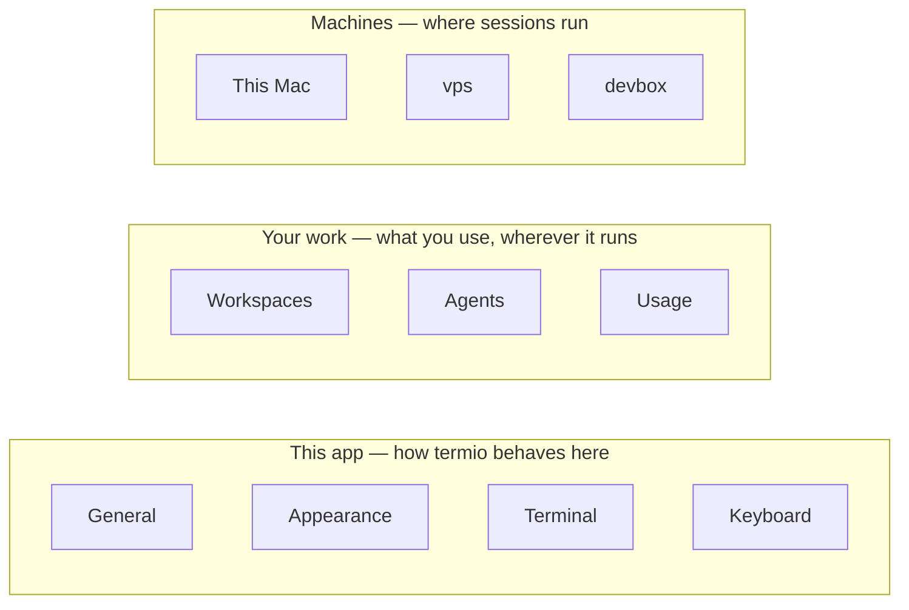

# Settings that know which machine they mean

Created on 2026-08-24
Implemented on _TBD_

## Summary

The Settings window silently means *this Mac*, and stopped being true when
sessions started running on other machines. Split its contents by what a value
**is** — a fact about a machine, or an intent of the user's — rather than by a
precedence chain, and make **location in the UI the scope** so nobody has to learn
a rule. Agent availability, command paths, installed integration and serving
credentials become per-machine; theme, font and keybindings stay global; a small
per-machine **tint** serves the "prod is red" instinct without forking the theme.

## Motivation

Every one of these is a fact about this Mac, presented as if it were app-wide:

- The `(!)` badge on an agent row is this Mac's `PATH` and only ever that
  (`AgentAvailability.swift:16`, `AgentSettingsTab.swift:261`).
- `agents.commandOverrides` is one value per agent with no machine dimension
  (`Settings.swift:125`).
- `AgentStatusHooks.sync` and `SessionSkillInstaller.sync` write into an agent's
  config directory; they now accept a target (`AgentConfigStore`) and **no caller
  passes one**.
- The Usage tab reads `homeDirectoryForCurrentUser/.claude/.credentials.json`
  (`ClaudeUsageProvider.swift:17`) while the agent burning that quota may be on a
  VPS.
- The tab that should own machine identity is occupied: `SettingsTab.swift:23` is
  `case devices = "ssh"`, so the shipped "Devices" tab is the renamed SSH tab — a
  `~/.ssh/config` projection, which `20260814-remote-to-device.decisions.md` §1 classifies
  as *routes*.

Device architecture §4.1 assigns ownership for rendering, viewport, clipboard,
filesystem and workstream status. **Agent configuration is in neither column.**
That is the gap.

## Non Goals

- Not a sync or profile system. Nothing here syncs between Macs.
- Not a per-device theme. See §Alternative implementation.
- Not Usage scoping. Reading another machine's credential file is a different
  trust question and gets its own decision.
- Not a change to what any setting *does* — only to which machine it means.

## Impacted components

| Component | Change |
| --- | --- |
| `Sources/termio/Settings/` | Tab grouping, a Machines surface, per-machine panes |
| `SettingsFile.swift` (`SettingsStore`) | A device section in `settings.json` |
| `~/.termio/devices/<host_id>.json` | New: discovered state, a cache |
| `AgentConfigStore` | Already the per-machine probe and file access; gains callers |
| `termiod` | Later: serves a device's own settings (§Unresolved 3) |

## Proposed implementation

### The model: capabilities and intent

Three kinds of value, and they do not compose into one chain:

- **Capabilities** — keyed by `host_id`, describing one machine. No fallback.
  Two halves with different lifecycles: *discovered* facts, regenerable and
  disposable, and a small *authored* map (the command path chosen for that box).
- **Intent** — the user's preference, plus optionally a narrow per-workspace
  override (default agent, order). Never executable configuration.
- **Viewer** — theme, font, keyboard, terminal. One value per app install, never
  scoped by machine.

**Availability is a constraint. It filters; it never overrides.** Intent is
resolved against capability when a session starts, and any substitution is stated
in words: *"Started Codex — Claude isn't installed on `vps`."* Not a Settings
badge; the session start is where the substitution happened.

### D1 — Location in the UI is the scope

> You never edit a machine's value from a preference tab, and you never set a
> preference from a machine's row.

- **Settings ▸ Agents** = *what you use*. Enabled set, order, default agent, and
  the per-agent pane's manifest-level config. Plus a **passive** readiness line
  linking to the machine.
- **A machine's pane** = *what that machine is*. Reachability, `termiod` version
  and deploy, per-agent presence and command path, hooks and skill, serving.

The absence of a device control on Appearance is what says Appearance is not
scoped. One copy rule follows, the only one this RFC adds to `VOICE.md`: **a
scoped action names its machine.**

**Note the shape the code is now in.** `AgentDetailPane` is a pushed per-agent
pane holding the enable switch, command override, install link and bypass switch.
The obvious wrong turn is to add a device *picker* there — and it was taken, and
undone. **D10 supersedes this paragraph's original answer**: the command override
does not move to the machine's pane. It stays on the agent's pane as one row per
machine, because the task it serves — get this agent running everywhere — walks the
machines while holding the agent fixed, and a picker is the one shape that cannot
show all of them at once.

### D2 — Resolve the tab-name collision first

`devices = "ssh"` today. `20260814-remote-to-device.decisions.md` §1 chose *coexist* — SSH
owns routes, Devices owns identities — and the shipped app renamed SSH to Devices
instead, which is neither outcome.

**Proposed:** one tab, one row per machine, two sections inside a machine's pane —
*how it is reached* (alias, destination, identity file, Test Connection, Edit
config) and *what it is* (D1's second bullet). Two tabs that both list machines
force the user to learn the route/identity distinction; one pane that shows both
does not. This reopens §1 explicitly. **Nothing else here can land until it is
settled.**

### D3 — Theme is global; a machine gets a tint

Colouring a production shell red is a safety habit, not decoration — it is what
tmux status lines and iTerm2 host profiles have always been for. Serving it by
scoping the theme would be wrong: the theme is viewer-owned (device architecture
§4.1) and a colour scheme that changes on workspace switch is disorienting.

| | Theme | Device tint |
| --- | --- | --- |
| Answers | how termio should look | which machine am I on |
| Scope | one per app install | one colour per `host_id` |
| Applies to | whole UI and terminal palette | chrome only: machine row, sidebar mark, hairline |
| Set in | Appearance | that machine's pane |

One rule bounds it: **a tint is optional, defaults to none, and appears only as
chrome** — a dot or a hairline, never a filled background behind a control.

### D4 — Three readiness states

`AgentAvailability` answers *available* when the probe itself fails rather than
crying wolf (`:47`), and `AgentConfigStore.isCommandInstalled` already carries
that rule per machine. A remote probe fails far more often — asleep box, dead
tunnel, wrong alias — so the third state has to be rendered, and today is not:

| State | Row shows | Meaning |
| --- | --- | --- |
| available | the launch command alone | the CLI is there |
| missing | `Not installed · <command>` + `(!)` | the machine answered; it is not there |
| **unknown** | `Can't check on vps · <command>` | we could not ask |

The shipped row (`AgentListRow`) already carries the command on a second line with
`Off ·` / `Not installed ·` leading it. The third state is the addition.

### D5 — Announce fallback where it happens

Covered by §The model: at session start, in one sentence, never as a Settings
badge.

### D6 — One line, not a ladder

Deploy `termiod` → probe agent CLIs → install hooks and skill is a real dependency
chain, and wrong as a primary UI: four rungs with independent states turn choosing
a machine into infrastructure triage.

**The machine's pane shows one outcome — "Ready", or "Set up this device."** One
click runs the whole safe chain and surfaces only the **first blocking failure**.
The ladder is the disclosure behind it. This surface also owns *when* the
installers run; [20260824-agent-integration-on-a-device.md](20260824-agent-integration-on-a-device.md)
owns how they behave.

### D7 — Storage follows from scope

`SettingsStore` already writes `~/.termio/settings.json` with only the keys the
user set, so it stays short enough for a dotfiles repo (`SettingsFile.swift`).

- **Authored** — per-machine command paths, the tint, workspace intent → a section
  in that same `settings.json`.
- **Discovered** — availability probes, `termiod` version, integration state →
  `~/.termio/devices/<host_id>.json`, deletable at any time, **never
  authoritative**.

Keying by `host_id` and not alias keeps one box reached three ways as one blob —
the bootstrap/stable split `KnownDevice` already uses. **Name the Mac's device file
a cache from the day it is written** (see §Unresolved 3).

### D8 — Regroup the window so its shape is the model

Ten flat tabs teach nothing. Three groups, mapping one-to-one onto the model:

`Community` stays pinned below the groups; it is About, not a setting.

**Machines is one tab that drills down**, not a row per box in the sidebar.
`SettingsView` now owns a `NavigationPath` and empties it on tab switch, and the
Agents tab pushes a per-agent pane onto it — so a machines list that pushes a
machine's pane is the idiom the window already has. (An earlier draft said to
reuse a three-column list/detail layout; that layout was removed when Agents
became a drill-down.)

What moves:

| Today | Moves to | Why |
| --- | --- | --- |
| General ▸ Agent skill (Session control, Reinstall skill) | the machine's pane | It installs into an agent's config dir **on a machine**. |
| General ▸ Status (Live agent status, Reinstall hooks) | the machine's pane | Same, and it is why a VPS agent has no hook status. |
| General ▸ Command line (install the `termio` CLI) | **This Mac's** pane | Installing a CLI on a machine is a machine operation; it sits beside "deploy `termiod`" on every other pane. |
| Agents ▸ per-agent command path | the machine's pane | D1, D7 authored half. |
| **Mobile** | the machine's pane, as its **Serving** section | D9. |
| Devices (`= "ssh"`) | Machines | D2. |

What remains in General — language, notifications, GitHub — is app-and-account
scope, and the tab stops lying.

### D9 — Mobile is a machine's Serving section

Everything in `Settings ▸ Mobile` is a fact about one machine: the companion
port, the pairing token, the QR encoding them, the tunnel, and which phones are
paired **to that Mac**. It looks app-scoped only because the Mac is currently the
only machine that serves anything — which `termiod serve --wss`
([20260824-ios-as-device-client.md](20260824-ios-as-device-client.md)) ends.

| Section | This Mac | A device |
| --- | --- | --- |
| Reached by | it is here | alias, destination, identity file, Test Connection |
| Runs | `termio` CLI, agent CLIs, hooks and skill | `termiod` version + deploy, agent CLIs, hooks and skill |
| Serving | companion: port, QR, token, tunnel, paired phones | `serve --wss` bind, pair token + `--qr`, origin, paired clients |

Pairing a phone with a Mac and with a VPS are the same feature on two machines —
the enrollment ladder in [20260824-ios-as-device-client.md](20260824-ios-as-device-client.md) §D4
already treats them so. The discoverability cost is paid elsewhere, not by a
duplicate entry: **pairing is an action, and actions live in the command palette
and the menu bar.** Settings holds the server's state.

### D10 — Machines are rows, not a mode

D1 says location in the UI is the scope, and left one gap: a page that reports a
machine fact without naming the machine has a scope you cannot see. A picker was
shipped for that gap (`DeviceScopeBar`, `43b56ca`) and is retired here. It answered
the visibility complaint by introducing a worse problem — a **mode**.

A picker changes what the rest of the page means, so the machine has to be
remembered rather than read, a mis-remembered one quietly configures the wrong box,
and every page touching a machine needs its own copy of the control (the phone
included). Worst of all it hides the fleet: a picker shows one machine at a time, so
an agent installed here and missing on `devbox` reads as fine until you happen to
switch to `devbox` — the exact question a tool for managing several machines exists
to answer.

> **Exactly one surface selects a machine — the Machines list. Everywhere else,
> machines are rows.**

Which page holds which axis follows from its subject:

| Page | Subject | Machine is |
| --- | --- | --- |
| A machine's pane | one machine | the page (chosen by navigation) |
| Agents ▸ an agent | one agent | a row per machine, each with its own path |
| Agents roster | the agent list | a summary — `Not installed on devbox` |
| Agents ▸ Integration | a preference | not chosen at all: it installs on **all** |

The property that lets this be the default rather than an advanced mode: **a roster
of one renders exactly as the page did before there was more than one machine** — no
list, no labels, no bar. That is what a picker cannot do; a picker with one option
still costs a row and still asks a question with one answer.

Two consequences worth stating:

- **`AgentReadiness.passive` becomes load-bearing.** The roster now asks N machines
  instead of one, which is only affordable because passive means a cached `PATH`
  probe locally and a device-file read remotely. If any of it ever reaches the
  network, this has to go back to naming one machine.
- **The iOS companion gets no picker.** It does not author machine configuration;
  if it surfaces readiness at all it shows the same list, read-only.

### Reliability, failure modes and corner cases

- **Unreachable machine.** Renders "can't check", never "not installed" (D4). A
  `(!)` that means "we could not reach the box" sends the user to reinstall
  something already installed.
- **Stale cache.** The discovered file is regenerable and never read as authority.
  One read path treating it as truth recreates the problem this RFC exists to fix.
- **Switching workspaces.** Explicit selections do not re-target — looking at
  `vps` in the machines list survives a workspace switch. Ambient indicators do:
  the Agents readiness line follows the current workspace's device. Nothing else
  redraws; a Settings window that visibly re-renders on every switch reads as
  instability.
- **`onMove` is inert in a `Form` on macOS.** D8's regrouping will move rosters
  between containers; a roster swept into a `Form` renders perfectly and silently
  stops reordering. Any reorderable list stays a `List`.

### Unresolved questions

1. **Does workspace intent exist in v1?** Least-proven of the three scopes and
   purely additive later. User + device first is defensible.
2. **Where does "Set up this device" live** — only the machine's pane, or also as
   a prompt on first entering a workspace on an unprepared machine? The second is
   better UX and worse discoverability.
3. **When does the device file stop being the Mac's?** §2.1 points at `termiod`
   owning and serving it — a phone attached directly to a VPS cannot read the
   Mac's `settings.json` — but that depends on protocol and storage work this RFC
   does not decide. A dependency, not a schedule.
4. **Does the tint reach inside the terminal**, or stop at app chrome? A hairline
   within the terminal's bounds competes with the theme it is meant not to touch.

## Alternative implementation

**One precedence chain** — `workspace ?? device ?? user ?? default`. This was the
first draft and it is wrong: a fact and a preference cannot share a chain. A
machine does not *inherit* whether `claude` is installed. Written as a chain the
device layer reads as another preference layer overriding yours, and two formally
correct answers contradict each other — a workspace resolving "default agent =
Claude" on a machine that cannot run Claude.

**Chromium-style isolation** — one settings store per scope, nothing inherited, as
Chromium and Dia do with `Local State` plus a `Preferences` per profile directory.
Right for browser identities, wrong here: it would give every machine its own
font.

Two independent editors chose the layered split instead, and both put the
machine-scoped file on the machine: **VS Code Remote-SSH** (User → Remote →
Workspace, Remote stored at `~/.vscode-server/data/Machine/settings.json` —
[docs](https://code.visualstudio.com/docs/remote/ssh)) and **Zed** (Local / Server
/ Project, Server stored on the server —
[docs](https://zed.dev/docs/remote-development)). That is the evidence behind D7
and nothing else here rests on it.

## Definition of Done

1. D2 settled; a Machines surface exists.
2. `SettingsStore` resolves a device section; `~/.termio/devices/<host_id>.json`
   is written, read as a cache, and safe to delete.
3. Agents shows readiness in all **three** states, summarised across the roster,
   and every machine value it holds is a row naming its machine (D10). No control
   anywhere selects a machine except the Machines list.
4. A machine's pane installs hooks and skill on **that** machine — the first
   caller to pass a target to `AgentConfigStore` — and Agents ▸ Integration
   installs on every machine without asking which.
5. General no longer contains a machine operation.
6. Mobile's contents render as This Mac's Serving section; "Pair a phone…" is
   reachable from the command palette.
7. Switching workspace re-targets ambient indicators only, verified on screen.
