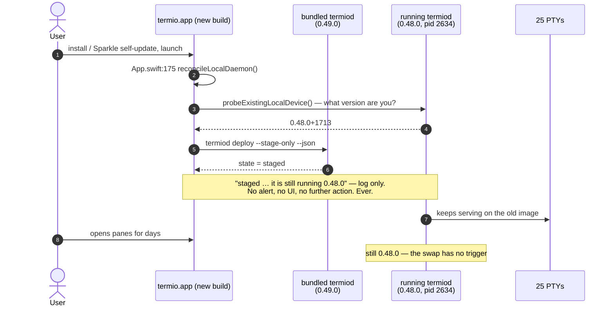
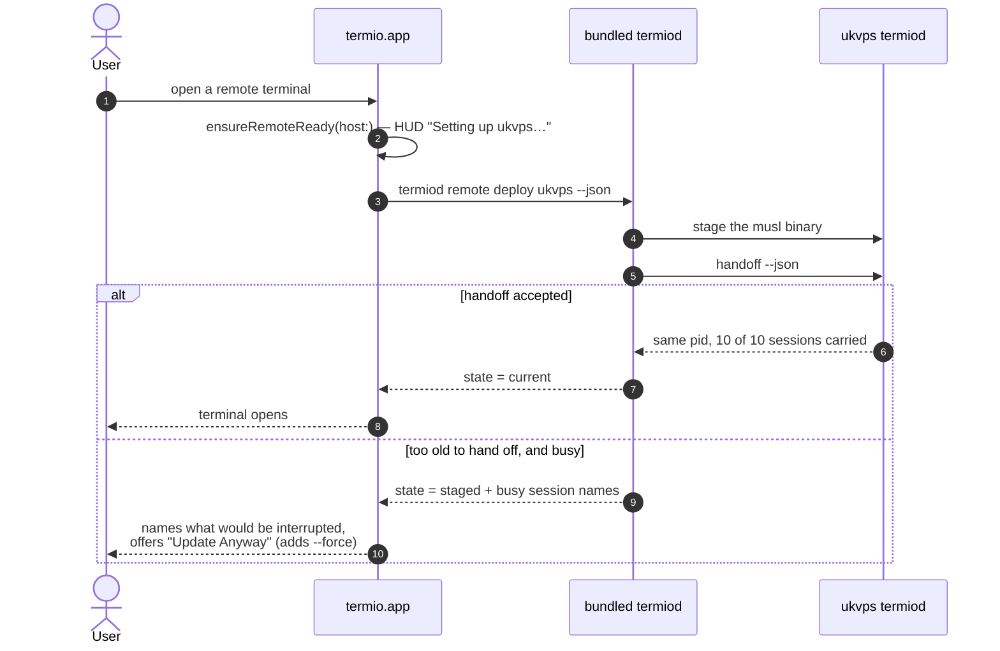
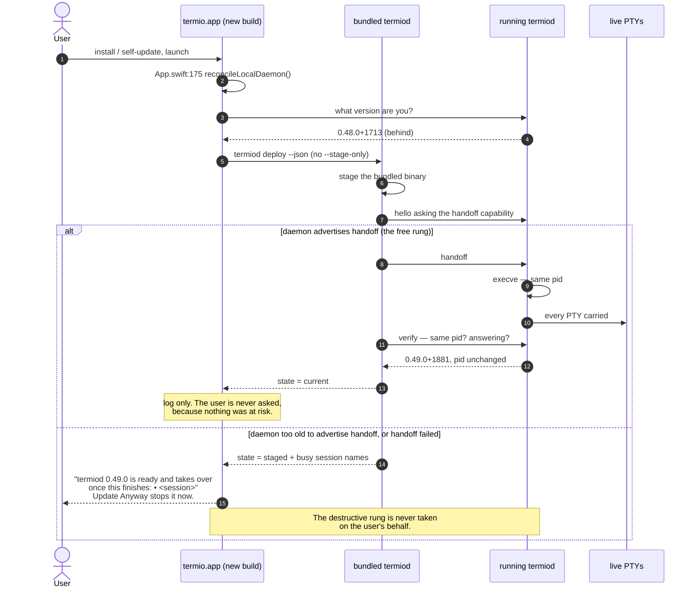
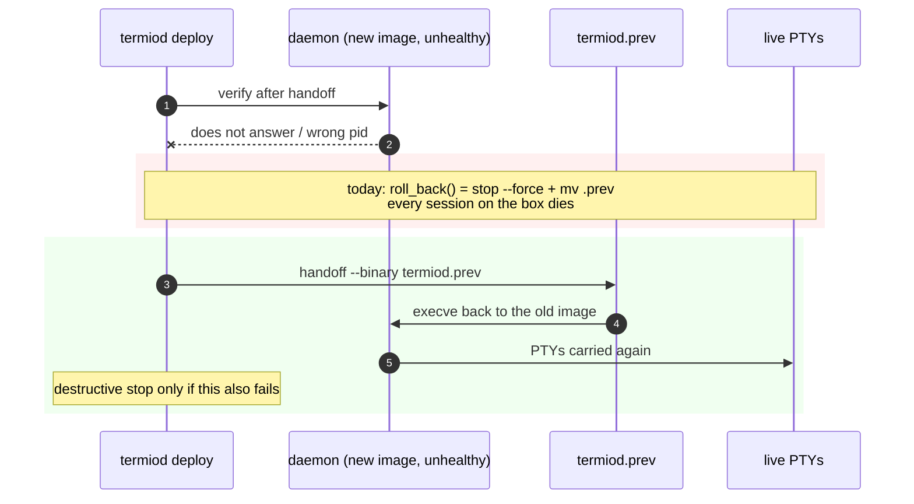

# Installing the app should update this Mac's termiod

> Make the daemon on this Mac follow the app that ships it, using the same
> ladder every remote box already gets — automatic while it is free, asking
> only at the rung that costs a session.

---

## 1. The bug, in one sentence

Updating `termio.app` stages a new `termiod` and leaves the running one alone
forever, so this Mac is the only machine the app talks to that never gets
current.

The doc comment above `reconcileLocalDaemon()` already says it
(`Sources/termio/Terminal/Termiod/TermioStore+Termiod.swift:1421`):

> The daemon outlives the app deliberately: that is what makes a session
> survive quit. The cost is that updating the app replaces the binary in the
> bundle and leaves the *process* running whatever version it started with,
> indefinitely — this Mac was observed a full release behind while every box it
> talks to was current, because a remote is reconciled before each terminal
> opens (`ensureRemoteReady`) and the machine the app runs on was the one
> nobody asked.

### Evidence

| machine | app | daemon | how long |
| --- | --- | --- | --- |
| this Mac, 2026-09-04 | 0.49.0+1881 | 0.48.0+1713 | since the 0.49.0 install |
| ukvps, same day | — | 0.48.0+1713 | same |
| [#609](https://github.com/termio-sh/termio/issues/609) reporter | 0.49.0+1881 | **0.47.0+1639** | two releases behind |

Both local daemons were brought current with a single `termiod handoff`: same
pid, 25 sessions kept locally and `10 of 10 session(s) carried` on ukvps. The
capability to fix this has been shipped and working the whole time; nothing
invokes it.

#609 is the cost being paid: a user filed a rendering bug whose first suspect
was the skew, having sat two releases behind without any signal that they were.

---

## 2. Why the current rule exists, and why it is stale

Stage-only was correct when *activating* a staged binary meant **stopping** the
daemon. The comment states that premise (`:1431`):

> An existing daemon is deliberately left alone. The later swap is deferred to
> an explicit deploy or the daemon's own restart, so launch can never terminate
> an idle session without the user asking.

`deploy` no longer works that way. It leads with handoff
(`termiod/src/lifecycle.rs:1035`):

> Handoff first, always. It is not an optimisation over stopping: it is the
> difference between an upgrade the user pays for in lost work and one they do
> not notice. Stopping stays as the fallback for a daemon too old to replace
> its own image, and as what `--force` reaches for when the handoff itself
> fails.

The premise the timid choice rested on is gone; the choice outlived it.

---

## 3. Current behavior



The remote path, for contrast, already does the right thing:



---

## 4. Desired behavior

The local path adopts the remote ladder. Nothing new is invented; the local
call site stops asking for `--stage-only` and gains the same dialog on the one
rung that costs something.



And the rollback path, which must stop being destructive before any of this
becomes automatic:



---

## 5. Why automatic is safe here — the properties this rests on

Each verified against the tree, because "automatic" is only defensible if these
hold:

1. **Handoff has no busy gate**, and needs none — nothing stops, so there is
   nothing to decline (`lifecycle.rs:631`). This is what makes automatic
   possible at all: a stop-based auto-update must wait for an idle moment that,
   with agents running, may never arrive.
2. **The target binary is executed for its version before the daemon is asked**
   (`binary_version(&binary)`), and the daemon *"vets the path before it takes
   a single session apart, so a refusal here costs nothing."*
3. **A handoff is verified, not assumed** — the pid must be unchanged and the
   daemon must answer again, or the loop reports *"it was restarted, not handed
   off."*
4. **Rollback is already a supported request**: `--binary` naming an older
   build is documented as *"a legitimate request — a rollback."* The mechanism
   exists; `roll_back()` simply does not use it yet.

### The boundary

**Automatic through the handoff rung. Never automatic through the stop rung.**

`roll_back()` is `stop --force` + `mv .prev` (`lifecycle.rs:1185`), so the
failure path costs every session on the box. Automatic must mean "automatic
when it is free", not "automatic including the expensive rung" — otherwise this
rebuilds the thing docker had to apologise for with `live-restore`, which even
after ten years is *"only supported when installing patch releases (`YY.MM.x`),
not for major (`YY.MM`) daemon upgrades."*

termio can make the stronger promise because the state is live PTYs held by a
pid, not a serialised format a new daemon must re-read — but only while
automatic never falls through to stopping.

---

## 6. The change, in order

### Change 1 — rollback via handoff (`termiod/src/lifecycle.rs`)

`roll_back()` tries `handoff --binary <binary>.prev` first and only falls
through to `stop --force` + `mv` when that fails. Safety net before anything
starts firing automatically.

- Touches: `roll_back()` at `:1185`.
- Test: `an_unhealthy_new_image_is_rolled_back_without_stopping` — a fake node
  whose new image fails verification, asserting the recorded commands contain a
  `handoff --binary` and no `stop --force`.

### Change 2 — local launch reconcile takes the same ladder

`reconcileLocalDaemon()` drops `--stage-only` and handles the full `Outcome`
set the remote path already handles: `Current` logs; `Staged` raises the same
"names what would be interrupted / Update Anyway" dialog as
`performRemoteReadyCheck`; `Unhealthy` reports what rollback did.

- Touches: `reconcileLocalDaemon()` at
  `Sources/termio/Terminal/Termiod/TermioStore+Termiod.swift:1441`; reuses the
  `.staged` message construction at `:1386-1400` rather than writing a second
  one.
- The launch moment is unchanged and is still the right one: *"before the first
  control channel opens and long before a pane attaches"* (`App.swift:170`),
  off the main queue so a wedged daemon cannot delay the first window.
- The equality guard on `AppInfo.bundledStamp == desired` stays exactly as is —
  a dev build must never stage itself over a released daemon.

### Change 3 — `termio version` names the local skew

A stale **local** row gets the hint the RFC mock already gives remote rows.
Today a behind local daemon is the one case with no command to run:

```
termiod local  0.48.0+1713   proto 1   ← behind; run `termiod handoff`
```

- Touches: the `termio version` table assembly (shipped in PR #543 per
  `20260831-docker-dockerd-lessons.md` §8 item 1).

---

## 7. Risks, honestly

| risk | mitigation |
| --- | --- |
| A bad new image `execve`s successfully then dies — PTYs die with it. Rollback cannot resurrect them. | Change 1 first. Beyond that this risk already exists on every `deploy` the user runs today; automatic widens exposure to every release, which is the argument for shipping 1 before 2, not for skipping 2. |
| Handoff itself regresses in some release, and now it fires for everyone unprompted. | The verify step (pid + reconnect) already catches a failed handoff and reports `Unhealthy`; with Change 1 that path is non-destructive. Add the handoff assertion to CI so a regression is caught before a tag. |
| Two dev builds / channel confusion staging over each other. | Unchanged: the `bundledStamp == desired` guard already refuses, and the Rust loop declines a dev build over a released daemon. |
| A user wants to stay behind deliberately. | Out of scope here and better answered by the support window (§8). Currency is the wrong trigger; compatibility is. |

---

## 8. Not in scope

- **The support window** (`20260831-docker-dockerd-lessons.md` §2, §8 item 4):
  making the trigger *incompatible* rather than merely *behind*. That is the
  real answer to #609 — a 0.49.0 app spoke happily to a 0.47.0 daemon across a
  change that flipped what an `R` frame means while `PROTOCOL_VERSION` stayed
  `1` (`termiod/src/protocol.rs:34`, `c62a684b`). A capability gate caught it
  (`TermiodClient.swift:1414`); policy did not. Separate change, larger, and
  scheduled there.
- **Remote behavior.** Already correct; this doc copies it rather than touching
  it.
- **#609's rendering bug itself.** The skew is a contributing suspect, not a
  diagnosis. The experiment that splits it is one `termiod handoff` on the
  reporter's machine.

---

## 9. How this gets verified

- `cargo test` in `termiod/` for Change 1, including the new rollback test.
- `swift build` for Change 2.
- Manual, on a real skew: install a build over a running older daemon, launch,
  and confirm `termio version` reads matched afterwards with the session count
  unchanged and the same daemon pid.
- The negative case, forced: point the reconcile at a daemon that does not
  advertise `handoff` and confirm the dialog appears and nothing is stopped
  without the button.
